# Day 2. Population structure and differentiation <!-- omit from toc -->

## Table of contents <!-- omit from toc -->

- [Tutorial 1](#tutorial-1)
  - [2-1. Calculating F-statistics](#2-1-calculating-f-statistics)
      - [(Optional) Investigate structure in relation to geography](#optional-investigate-structure-in-relation-to-geography)
  - [2-2. Principal Component Analysis (PCA)](#2-2-principal-component-analysis-pca)
    - [Load the required R packages](#load-the-required-r-packages)
    - [Load the input data files](#load-the-input-data-files)
    - [Impute missing data](#impute-missing-data)
    - [Run and visualise PCA](#run-and-visualise-pca)
    - [Explore PCA loadings](#explore-pca-loadings)
    - [PCA on the Canadian dataset only](#pca-on-the-canadian-dataset-only)
- [Tutorial 2](#tutorial-2)
  - [2-3. Population structure with LEA](#2-3-population-structure-with-lea)
    - [Prepare input files](#prepare-input-files)
    - [Model ancestry proportions](#model-ancestry-proportions)
    - [Find the best *K* value](#find-the-best-k-value)
    - [Plot ancestry proportions across samples](#plot-ancestry-proportions-across-samples)
  - [2-4. Population structure with Discriminant Analysis of Principal Components (DAPC)](#2-4-population-structure-with-discriminant-analysis-of-principal-components-dapc)

# Tutorial 1

## 2-1. Calculating F-statistics
In the server, let's make a copy of the folder of **day 2** and work within it. 

The folder contains files equivalent to those you produced yesterday with Stacks, except that they are compressed to fit on GitHub. 

So, in case you did not manage to finish the tutorial or forgot where the files generated yesterday were stored (and even if you don't have access to the server and work on your own computer), don't worry! You can find them here:
```bash
cd # make sure you are at the root directory 
cp -r ~/Share/physalia_adaptation_course/02_day2 .
cd 02_day2
```

There are many ways, approaches, software, and formulas to calculate F<sub>ST</sub>, a relative measure of population differentiation. Here we will use mainly [VCFtools](https://vcftools.github.io/index.html). If you want to explore Stacks for summary statistics in your spare time, you can find a specific tutorial [here](summary_stats_stacks.md).

In VCFtools you need to provide two files, a file listing the samples for each population that should be included in the calculation, and a VCF file with all genetic variants and associated information. For the reduced dataset, including only 80 individuals from Greenland and Canada, you will find the list of samples for each of the two lineages in the `~/scripts/` folder. The VCF file name is `populations.snps.vcf`, one for each of the datsets we analyzed. For example, to calculate F<sub>ST</sub> in the smallest of the three datasets we produced, type:
```bash
# activate the conda environment
conda activate adaptg

# uncompress file
gunzip populations_2lin_random/populations.snps.vcf.gz

# run VCFtools
vcftools --vcf populations_2lin_random/populations.snps.vcf --weir-fst-pop documents/pop_canada40.txt --weir-fst-pop documents/pop_greenland40.txt  --out FST/fst_2lin
```

Note that we directed all the vcf output inside the FST folder.
In the terminal, you get:

```bash
VCFtools - 0.1.17
(C) Adam Auton and Anthony Marcketta 2009

Parameters as interpreted:
	--vcf populations_2lin_random/populations.snps.vcf
	--weir-fst-pop /home/ubuntu/scripts/pop_canada40.txt
	--weir-fst-pop /home/ubuntu/scripts/pop_greenland40.txt
	--keep /home/ubuntu/scripts/pop_canada40.txt
	--keep /home/ubuntu/scripts/pop_greenland40.txt
	--out fst_2lin

Keeping individuals in 'keep' list
After filtering, kept 80 out of 80 Individuals
Outputting Weir and Cockerham Fst estimates.
Weir and Cockerham mean Fst estimate: 0.032099
Weir and Cockerham weighted Fst estimate: 0.22947
After filtering, kept 8530 out of a possible 8530 Sites
Run Time = 1.00 seconds
```
The calculation is very fast. In addition to per-site estimates, you get mean and weighted F<sub>ST</sub> estimates, which you could display in a separate logfile generated by VCFtools and called `less FST/fst_2lin.log`.

If you have a reference genome and a panel of SNPs dense enough (or whole genome resequencing data) you can calculate window estimates with:
```bash
vcftools --vcf populations_2lin_random/populations.snps.vcf --weir-fst-pop documents/pop_canada40.txt --weir-fst-pop documents/pop_greenland40.txt  --out FST/fst_2lin_win --fst-window-size 100000 --fst-window-step 100000
```
In fact, window estimates are a practical way to summarize data and to reduce the number of data points to handle, which can be problematic for plotting (visualization). Windowed estimates will reduce the effects of single SNPs on the overall signal and will thus capture the trend in the F<sub>ST</sub> signal.


Now, to visualize the results, we recommend that you download the file from the server to your own computer using [FileZilla](https://filezilla-project.org). It is better to download the whole folder `02-day2`, so that you always work with the same folder/file names and hierarchy as the rest of the group.

On your local computer, in RStudio, set your working directory to the target directory by using `setwd("/path/to/02-day2")`.

To create a Manhattan plot, there are great packages like [QQMan](https://cran.r-project.org/web/packages/qqman/vignettes/qqman.html) and others.

Or you can also use the R package `ggplot2`:
```R
# load package
library(ggplot2)

# load FST file
Fst <- read.table("FST/fst_2lin_win.windowed.weir.fst", header = TRUE)
# calculate the middle point of each bin
Fst$midPos <- (Fst$BIN_START + Fst$BIN_END) / 2
# explore the object
head(Fst)

# plot
ggplot(data = Fst, aes(x = midPos / 1000000, y = WEIGHTED_FST, col = CHROM)) +
  geom_point() + 
  geom_smooth() + 
  theme_classic() +
  facet_grid(cols = vars(CHROM), scales = "free_x", space = "free_x") +
  labs(x = "position (in MB)")

```
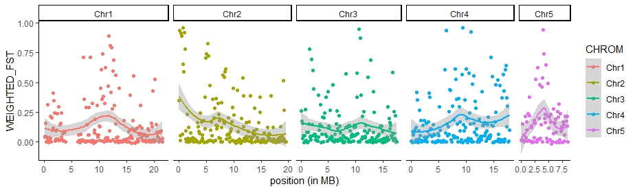

Back on the server:

We can also calculate π with VCFtools using the command:
```bash
vcftools --vcf populations_2lin_random/populations.snps.vcf --site-pi --keep documents/pop_canada40.txt --out FST/pi_canada
```
However, these single-site estimates of π are not very meaningful. π is defined as the average number of nucleotide differences per site between two DNA sequences in all possible pairs in the sample population. That is the same reason why π averaged across polymorphic sites in Stacks is not meaningful either. π must be averaged across the whole length of the sequence you are analyzing (number of variant + invariant sites), whether it is a collection of RAD loci or whole chromosomes. [pixy](https://pixy.readthedocs.io/en/latest/) is an alternative tool that allows calculating π, d<sub>xy</sub> and F<sub>ST</sub> using a vcf file and its documentation provides a good explanation about this bias [(Korunes & Samuk 2021)](https://onlinelibrary.wiley.com/doi/10.1111/1755-0998.13326).

>OBS! Because there are so many different ways to estimate F<sub>ST</sub>, it is important to always report the program and the methods used.**

For example, Stacks adopts an AMOVA F<sub>ST</sub>-based approach by Weir (from Genetic Data Analysis II, chapter 5, "F Statistics," pp166-167), while VCFtools uses the F<sub>ST</sub> estimate by Weir and Cocherham (1984). These two methods may produce slightly different estimates. Furthermore, VCFtools generates a weighted estimate of F<sub>ST</sub> that may be better suited to capture genome-wide population differentiation.

#### (Optional) Investigate structure in relation to geography

To assess genetic structure in relation to geography and pre-existing partitions (e.g. sampling locations), we can also look into population pairwise F<sub>ST</sub>. Here is an extra tutorial to get a matrix of population pairwise F<sub>ST</sub> (for the 12 Canadian populations) and assess whether genetic differentiation is correlated with geographic distance (e.g., isolation-by-distance). If you have extra time, or need it in the future, you can find the tutorial at this link [Population pairwise F<sub>ST</sub> and IBD tutorial](Tutorial_day2_IBD_optional.md).


## 2-2. Principal Component Analysis (PCA)

Population structure leads to systematic patterns in measures of mean relatedness between individuals in large genomic data sets, which are often discovered and visualized using dimension reduction techniques such as principal component analysis (PCA). The results of PCA can produce "maps" of population structure that may reflect the samples' geographic origin dirstored by rates of gene flow (November et al., 2008) or other intra-genome evolutionary processes that can bond or dispel certain groups of samples. Using PCA in genomics is quite simple without the need to diving into the math.

For this analysis, we will convert vcf files into geno format (matrix of genotypes: 0,1,2) using the program VCFtools on the server.

Here, we will work with two vcf files:
* vcf file containing four populations with the two lineages (H, L, O, and U)
* vcf file containing 12 populations from Canada (A-L)

In genomics, PCA are multivariate analyses which could be biases by extremely rare variants (i.e. only represented by one sample)
>Linck, E., & Battey, C. J. (2019). Minor allele frequency thresholds strongly affect population structure inference with genomic data sets. Molecular Ecology Resources, 19(3), 639–647. doi: 10.1111/1755-0998.12995, https://onlinelibrary.wiley.com/doi/abs/10.1111/1755-0998.12995

So we will also restrict our matrix to the most frequent SNPs (MAF> 1%). We can do this using VCFtools:
```bash
# activate the conda environment
conda activate adaptg

# run vcftools 
vcftools --vcf populations_2lin_random/populations.snps.vcf --maf 0.01 --012 --out pca/populations_2lin_random

# if the second file is not unzipped, use:
gunzip populations_canada_random/populations.snps.vcf

vcftools --vcf populations_canada_random/populations.snps.vcf --maf 0.01 --012 --out pca/populations_can_random
```
Once this is done, you will see via the Terminal, using `ls pca` (for listing all files in the directory), that six new files have been generate:

* Two files ending with only `.012` contain genotypes information (0 for Ref homozygous, 1 for heterozygous, 2 for Alt homozygous and -1 for misisng data)
* Two files ending with `.012.pos` contain a list of SNP ids (Chromosme and Position) from the vcf file
* Two files ending with `.012.indv` contain a list of samples ids from the vcf file

In this folder we also have all the information about individuals. To explore the pca results, let's make a copy of the `pca/` folder from the server to your local computer. Download the six files that are inside the folder `~/02-day2/pca/`.

We will now work in RStudio using `02_day2` as working directory (you can confirm this by using `getwd()`, or assign the working directory using `setwd()`).

### Load the required R packages
```R
# load packages
library(dplyr)
library(magrittr)
library(tibble)
library(ggplot2)
library(reshape2)
```
During the PCA tutorial, we will use the awesome `%>%`. This code feature is a pipe, which takes the output from one function and feed it to the first argument of the next function. You may have encountered the Unix pipe `|` before.

### Load the input data files
```R
# 1. load the population map
popmap <- read.table("pca/info_samples.csv", h = TRUE, sep = ";")
# if this doesn't work, please import it manually or try 
popmap <- read.csv("pca/info_samples.csv", sep = ";")

# 2. load the geno data for the 2lin
geno.012_2lin <- read.table("pca/populations_2lin_random.012")[, -1] # load the genotype matrix
geno.012_2lin.pos <- read.table("pca/populations_2lin_random.012.pos") %>% # load SNPs info
mutate(., locus = paste(V1, V2, sep = "_")) # create a new column for SNP info name (CHR + position)
geno.012_2lin.indv <- read.table("pca/populations_2lin_random.012.indv") # load individuals info

# set rownames and colnames to the geno matrix
dimnames(geno.012_2lin) <- list(geno.012_2lin.indv$V1, geno.012_2lin.pos$locus)
# check the geno matrix
geno.012_2lin[1:12, 1:9]
```
```R
     Chr1_37052 Chr1_53559 Chr1_76199 Chr1_102662 Chr1_116280 Chr1_144508 Chr1_223680 Chr1_225678 Chr1_264059
L_01          0          0          0           0           0           0           0           0           0
L_02          0          0          0           0           0           0           0           1           0
L_03          0          0          0           0           0           1           0           0           0
L_04          0          0          0           0           0           0           0           0           0
L_05          0          0          0           0           0           0           0           0           0
L_06          0          0          0           0           0           0           0           1           0
L_07          0          0          0           0           0           0           0           0           0
L_08          0          1          0           0           1           1           0           0           0
L_09          0          0          0           0           0           0           0           0           0
L_10          0          0          0           0           0           0           0           1           0
L_11          0          1          0           0           0           0           0           1          -1
L_12          0          0          0           0           0           0           0           0          -1
```
### Impute missing data
Missing data in `*.012.geno` files from VCFtools are coded with -1. We will change it for NAs. And we will fill the NA values by the most common genotype across all samples for a given SNP:
```R
geno.012_2lin[geno.012_2lin == -1] <- NA

geno.012_2lin.imp <- apply(geno.012_2lin,2,function(x){
                           replace(x, is.na(x), as.numeric(names(which.max(table(x)))))})
```
>Why do you think is necessary to input missing values when performing a PCA?

### Run and visualise PCA
Next, we are ready to perform the PCA. The code is very simple, only one line!
```R
pca.2lin <- prcomp(geno.012_2lin.imp)
```
Now, we will look at some interesting stats from the PCA object. First we will plot the variances against the number of the principal component.
```R
screeplot(pca.2lin)
```
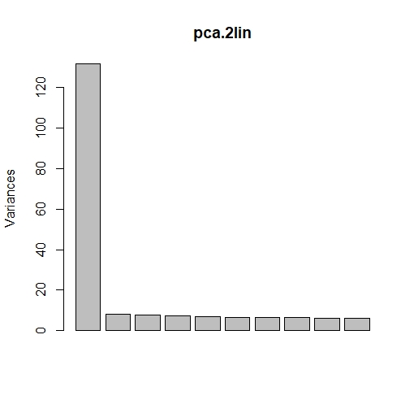

From the screeplot we can see that the amount of variation explained drops dramatically after the first component. This suggests that just one component may be sufficient to summarise the data.

Next, we will check for the proportion of variance explained by each PC axis.
```R
# get stats info from the pca
sum.pca <- summary(pca.2lin)
# print stats info
sum.pca$importance[, 1:5]
```
```R
                            PC1      PC2      PC3      PC4      PC5
Standard deviation     11.47642 2.867703 2.788018 2.730173 2.602429
Proportion of Variance  0.26852 0.016770 0.015850 0.015200 0.013810
Cumulative Proportion   0.26852 0.285290 0.301140 0.316330 0.330140
```
Here you can see that the first PC axis (PC1) explains 27% of the total variance. Other PC axes explain about 1.5% of the variance.

OK! Now we are ready to plot our PCA. There are many ways to do this, but here is an approach that uses the R library `ggplot2`, which is highly customizable. For this, we first make a synthetic dataframe which incorporates various features:
* Number of PCs that we want to examine (usually we keep the first four PCs, but you can keep more)
* Sample ids
* Populations info
* Any other attribute of your samples (e.g. size, color, sex, etc.)

and then make the plot using these commands:
```R
# prepare dataset to plot PCAs
pca.2lin.sub <- pca.2lin$x[, 1:4] %>% # retain the first four PCs
  as.data.frame(.) %>% #transform to dataframe object
  tibble::rownames_to_column(., var = "id") %>% # set rownames to a new column for samples ids
  dplyr::left_join(., popmap, by = "id") # here we use the left_join() function
                                         # from dplyr to wrap the population vector
                                         # of our samples.
# plot
ggplot(pca.2lin.sub) + aes(x = PC1, y = PC2, col = pop) +
  geom_hline(yintercept = 0, lty = 2, col = "grey50") + # add horiz line at y=0
  geom_vline(xintercept = 0, lty = 2, col = "grey50") + # add vertical line at x=0
  geom_point() + # add the samples
  scale_color_manual(values = c("orange", "purple", "royalblue", "cyan")) +  # define a new color scale
  theme_bw() + # use classic dark-on-light ggplot2 theme
  theme(panel.background = element_rect(fill = "white"), # set some theme options
        panel.grid = element_blank())

# save the plot as a PNG file
ggsave("pca/PCA_biplot_2lin.png", width = 6, height = 5)

```
Done! Good job :).
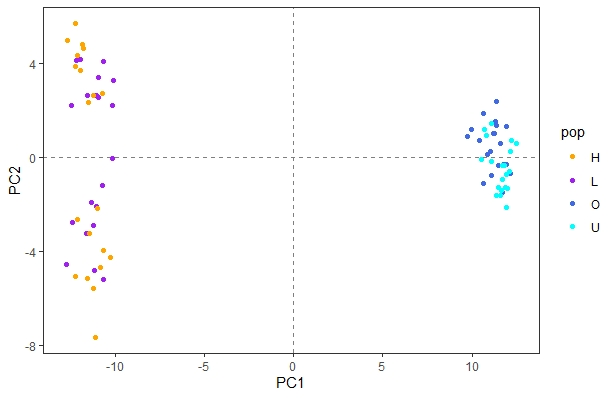

>Now, the question is, what does this plot mean?

### Explore PCA loadings
Let's plot the PCA loadings of each SNP for the main PC axes.
```R
# prepare dataset
loadings.melt <- reshape2::melt(abs(pca.2lin$rotation[, 1:4])) %>% # get absolute loadings values
  set_colnames(., c("SNPs", "PC", "loading")) %>% # set the colnames of the new dataframe
  mutate(., CHR = substr(SNPs, 1, 4)) # create a new column to inform about chromosome

# plot the data
ggplot(data = loadings.melt) +
  geom_bar(aes(x = SNPs, y = loading, fill = CHR), stat = "identity") +
  facet_wrap(~PC) +
  theme(axis.text.x = element_blank(),
        axis.ticks.x = element_blank())

# save it as a PNG file
ggsave("pca/PCA_loadings.png", height = 4, width = 15)
```
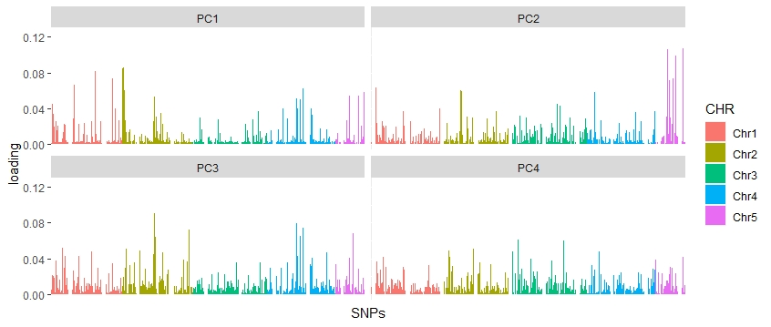

Here we can observe that many SNPs account for an elevated loading, which explains the structure of the PCA display above. Interestingly, we can observe that the SNPs with elevated loadings are spread across the genome.

### PCA on the Canadian dataset only
Now let's do the same analysis for the other dataset composed by 12 populations.

Test it and tell us what your conclusions are about it. You can run exactly the same script by simply changing the input file names. Just be aware that when you run ggplot, you may need to provide more colour values due to the larger number of populations. You can also try colouring individuals by sex.

Here is the script for the canadian populations, if you have not figured out already [PCA_12canada](pca/script_pca_12canada.r). And here is what you should observe: 

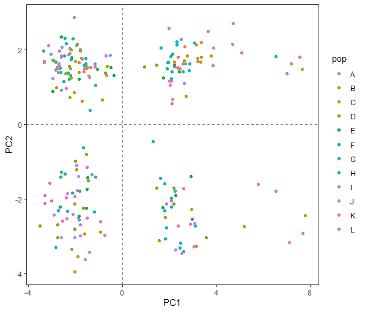
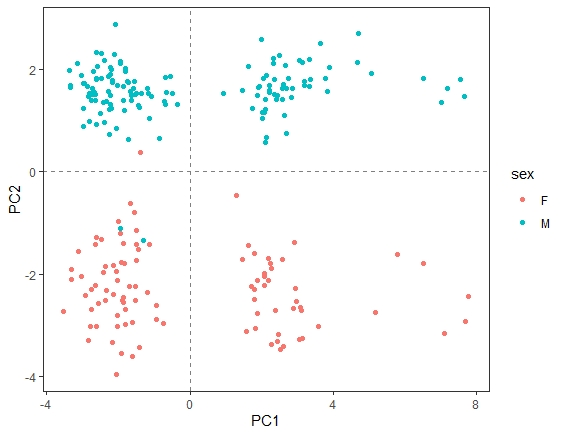

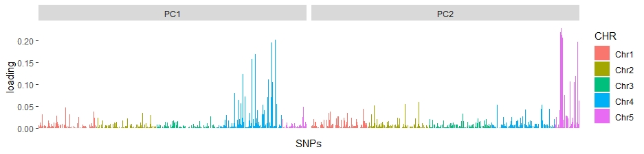

A long story short, what drives PC1 is likely a chromosomal rearrangement that we will better explore on day 4. PC2 is driven by sex. In weakly-structured species, this kind of rearrangements or sex-linked loci can largely drive population structure patterns in a PCA, the Admixture/Structure analysis, and F<sub>ST</sub>. Therefore, it is sometimes a good idea to exclude these regions from these analyses, or work on a subset of linkage disequilibrium (LD)-pruned SNPs.

# Tutorial 2

## 2-3. Population structure with LEA
Here, we will investigate population structure using LEA. Briefly, LEA is an R package developed by Eric Frichot and Olivier Fraņcois (Grenoble University, France), which is dedicated to landscape genomics and ecological association tests. This package includes many tools such as missing data imputation, genome scans for selection, testing for association between genotypes and environment, and analyses of population structure. Here, we only test the population structure approach, which is very easy to implement. If you want to learn more about LEA, you feel free to visit the R vignette at https://www.bioconductor.org/packages/devel/bioc/vignettes/LEA/inst/doc/LEA.pdf.

Here, we will screen for population structure among populations of two datasets, the `population_2lin_random.vcf` and the `population_canada_random.vcf` files.

Today, we will show you only the guidelines for the `population_2lin_random.vcf` dataset. Next, we let you to practice for the second one. 

Because LEA is an R package, you need to work under the R environment. We recommend that you do it on your own computer, but you can always start a R session on the server with the command `R`.

### Prepare input files
To conduct population structure analyses, LEA requires the input data in a specific file format (LEA geno-like format). The authors of the R package give us an useful function to easily convert the VCF file into this format, great 👍!

```R
# load the library
library(LEA)

# convert vcf to geno 
# note that we are working in the directory 02-day2 telling the program that the path of the populations.snps.vcf is inside the folder populations_2lin_random, and the output should go inside the folder LEA, with the name population_2lin_random.geno.
LEA::vcf2geno("populations_2lin_random/populations.snps.vcf",
              output.file = "LEA/population_2lin_random.geno")
              
```
### Model ancestry proportions
Now that we have our input file in the expected format, we will estimate individual admixture coefficients using [sNMF](http://membres-timc.imag.fr/Olivier.Francois/snmf/software.htm). This program is implemented as the `snmf()` function in the R package `LEA`. In short, this function provides results very similar to programs such as [STRUCTURE](https://web.stanford.edu/group/pritchardlab/structure.html) or [ADMIXTURE](https://dalexander.github.io/admixture/). Assuming *K* ancestral populations, the snmf function provides least-squares estimates of ancestry proportions rather than maximum likelihood estimates (Frichot 2014). 

The results allow us to determine what is the best *K* value (i.e. *the most likely number of genetic clusters*):
```R
# testing K populations: from K = 1 to K = 10
obj <- LEA::snmf("LEA/population_2lin_random.geno", K = 1:10, ploidy = 2,
            entropy = TRUE, CPU = 4, project = "new")
```
The snmf function computes an entropy criterion, which assesses the fit of the statistical model to the data using a cross-validation approach. The entropy criterion can help choosing the number of ancestral populations that best explains the genotypic data.

### Find the best *K* value
```R
# plot cross-entropy
plot(obj, col = "blue4", cex = 1.4, pch = 19) # best is 2 here, lowest value
# choose the best LEA run
best = which.min(cross.entropy(obj, K = 2))
```
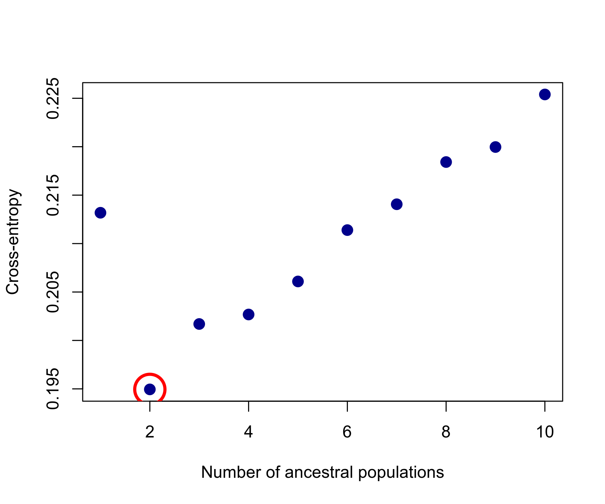

Here the lowest cross-emtropy value is clearly at *K* = 2, suggesting two genetic clusters within the dataset. Often, the plot shows a less clear pattern, and choosing the "knee/elbow/inflection" point is a generally good approach.

The next step is to display a barplot for the ancestry matrix (also called the Q-matrix).

### Plot ancestry proportions across samples
```R
barchart(obj, K = 2, run = best, border = NA, space = 0,
         col = c("red", "yellow"),
         xlab = "Individuals", ylab = "Ancestry proportions (K = 2)", main = "Capelin lineages")
```
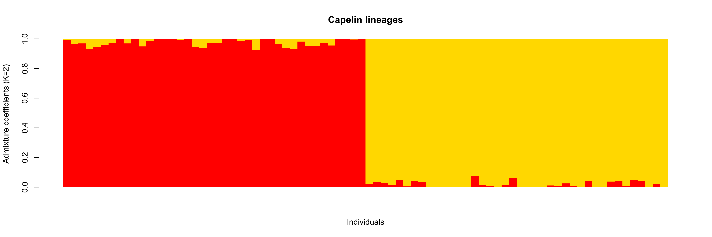

Well done!

>Now practice with the second dataset. What do the results indicate?

## 2-4. Population structure with Discriminant Analysis of Principal Components (DAPC)
A Discriminant Analysis of Principal Components (DAPC) is a multivariate approach that merges a Principal Component Analysis (PCA) and a Discriminant Analysis (DA). A PCA aims to summarize the variation among individuals and it runs very fast, also on large datasets. However, it is not powerful at discriminating groups because it doesn't use any a priori information on grouping, and intra-group variation can overwhelm inter-group variation. A DA, on the other hand, tries to summarize the variation among groups, while minimizing the variation within groups. Thus, a DAPC takes the best of the two analyses to describe population structure. Also, compared to structure-like analysis it is not based on strict model assumptions and it is more powerful at describing isolation-by-distance and hierarchical structure than the Bayesian approaches implemented in STRUCTRURE, fastSTRUCTURE, or ADMIXTURE.

In R studio, still with `02-day2` as working directory, we will use the R package [adegenet](https://adegenet.r-forge.r-project.org) to do a DAPC.

Adegenet can use as input file the one produced by Stacks with `*.structure` extension. However, it is necessary to rename the extension from `.structure` to `.str`, but here we already did that for you.

Let's start analyzing the reduced dataset including 80 individuals from Canada and Greenland.

**OBS! When you run the `import2genind()` function, a few questions will appear one at a time. You can find the answer to each question in the image below the code box. For each question, type the answer and press the `Enter` key. These responses are derived from the input file structure, which can be explored using the Terminal and the command `less -S populations_2lin_random/populations.str`**
```R
# load package
library(adegenet)

# load dataset and convert it from structure to genind format
twolin <- import2genind("populations_2lin_random/populations.str", onerowperind = FALSE, n.ind = 80, n.loc = 8530)
# this command will prompt questions about the structure of the file
# note that for the file provided, there are 80 individuals and 8530 SNPs
# column 1 contains labels for genotypes
# column 2 contains the population factor
# row 2 contains the marker names

```
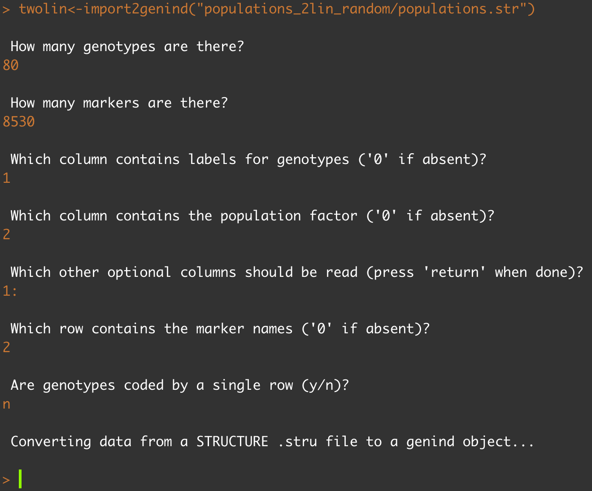
```R
# Once the dataset is loaded, you can proceed with the DAPC
dapc_twolin <- dapc(twolin) 
# again the command will prompt questions
# choose 50 PCs and 1 distriminant function, as you did have a choice...

# plot the results
scatter(dapc_twolin)
```
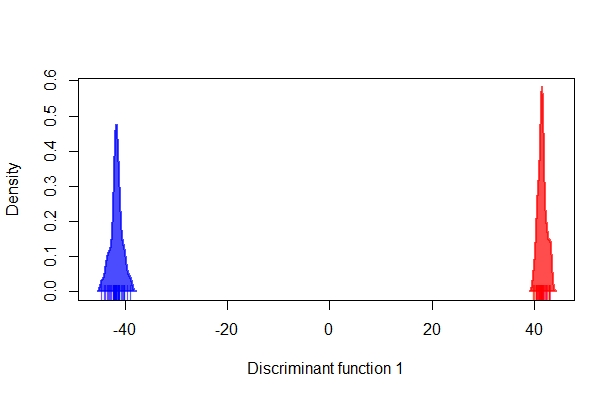

Because our dataset contains only two groups, NWA (Canada) and GRE (Greenland), there is only one discriminant function. For this reason, we can plot our results across only one axis of variation. However, this is enough to undoubtely separate the Canadian and Greenlandic lineages.

You can repeat this analysis for the full dataset `populations_all_random/populations.str`.
```R
all <- import2genind("populations_all_random/populations.str", onerowperind = FALSE, n.ind = 280, n.loc = 7943) 
# this dataset has 280 individuals and 7943 SNPs

dapc_all <- dapc(all) # play with the number of PC and DF

scatter(dapc_all)
```
>What do you see now?

If any structure is present among the Canadian populations, it may be hidden by the strong differentiation between the Canadian and Greenlandic lineages.

So let's repeat the analysis including only the Canadian populations, and use this to explore how to select the right number of PCs. Run and visualize the DAPCs based on 100 and 200 PCs.
```R
canada <- import2genind("populations_canada_random/populations.str", onerowperind = FALSE, n.ind = 240, n.loc = 8018) 
# 240 ind and 8018 SNPs
dapc_canada1 <- dapc(canada, n.da = 4, n.pca = 100)
dapc_canada2 <- dapc(canada, n.da = 4, n.pca = 200)
scatter(dapc_canada1)
```
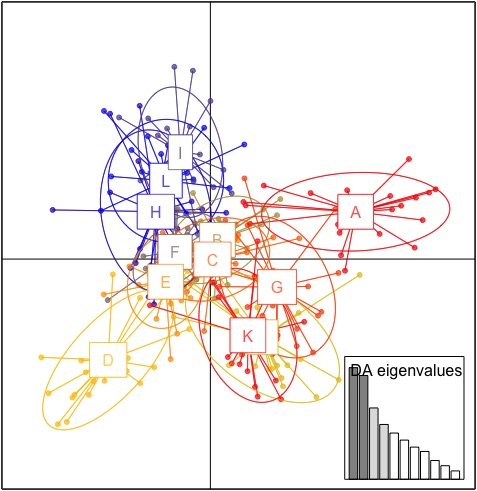
```R
scatter(dapc_canada2)
```
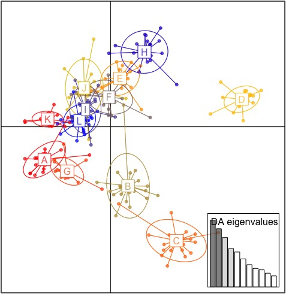

If too few PCs (with respect to the number of individuals) are retained, useful information could be excluded from the analysis, and the resultant model might not be informative enough to accurately discriminate between groups. In contrast, if too many PCs are retained, this could have a destabilising effect on the coefficients extimated, leading to problems of overfit. In such cases, the model is able to describe all of the data in such detail that it becomes flexible enough to discriminate almost perfectly between any possible clusters.

However, we can assess the trade-off between power of discrimination and over-fitting by calculating the alpha-score, which is the difference between the proportion of successful reassignment of the analysis (observed discrimination) and values obtained using random groups (random
discrimination).
```R
temp1 <- optim.a.score(dapc_canada1)
temp2 <- optim.a.score(dapc_canada2)
```
These analyses suggest fewer PCs should have been used, around 50.
```R
dapc_canada3 <- dapc(canada, n.da = 4, n.pca = 50)
```
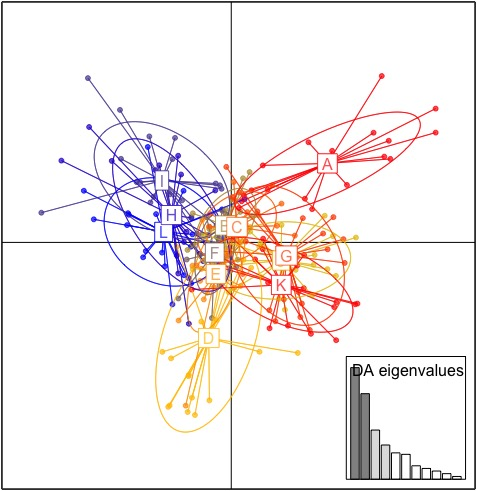

Another way to examine the effect of the number of PCs chosen is through stucture-like plots made with the function `compoplot`, which indicate the assignment proportions of each individual.
```R
compoplot(dapc_canada1)
```
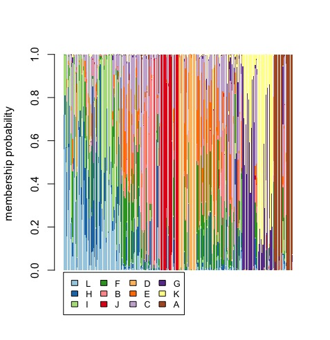
```R
compoplot(dapc_canada2)
```
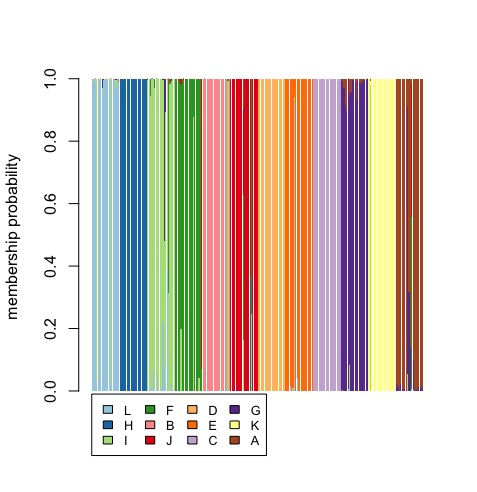
```R
compoplot(dapc_canada3)
```
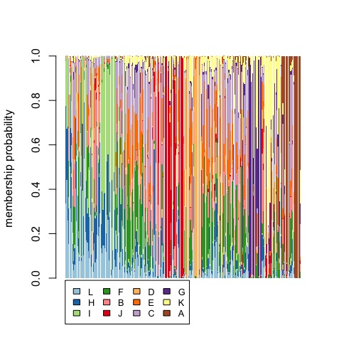

Although 200 PCs discriminate populations well, we know from low pairwise population F<sub>ST</sub> that differentiation is very low, which lead us to conclude that these high population assignments are the consequence of data over-fitting. On the other hand, the poor population assignemnt you obtain from 50 PCs is indicative of the weak population structure among the Canadian populations.

You can change pretty much everything in your plot and the authors of adegenet have put together a great tutorial <https://adegenet.r-forge.r-project.org/files/tutorial-dapc.pdf>.
