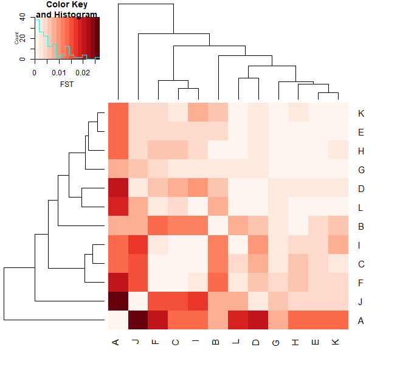
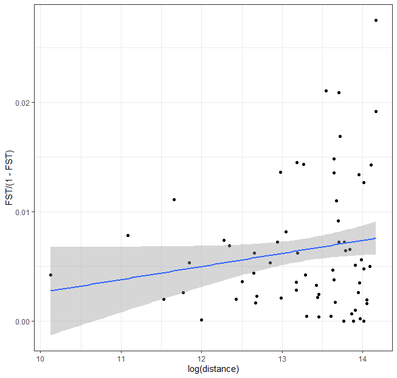
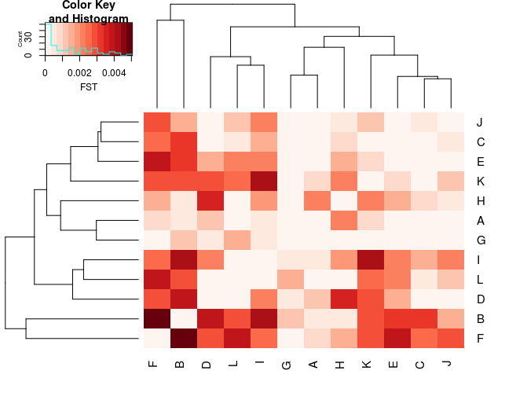

# (Optional) Investigate structure in relation to geography <!-- omit from toc -->

>NOTE (June 27, 2024)
> As the R package StAMPP is not working on the server, this tutorial was updated to be run on your local computer.


## Table of contents <!-- omit from toc -->
- [1. Pairwise differentiation between populations](#1-pairwise-differentiation-between-populations)
- [2. Isolation by distance (IBD)](#2-isolation-by-distance-ibd)

## 1. Pairwise differentiation between populations
We will calculate here F<sub>ST</sub> between all pairs of populations. F<sub>ST</sub> across the genome are expected to be largely driven by neutral markers while peaks of F<sub>ST</sub> may be related to selection for local adaptation. So we will first try to get a sense of the global pattern and then look for outliers.

To get pairwise F<sub>ST</sub>, we will use the R package `StAMPP`. To save some time today, we will use a toolbox developed by Yann Dorant. You may be interested in looking at the scripts to understand how this is done.

This toolbox embeds various useful scripts in order to easily convert a file in VCF format to common population genomics formats such as genepop, StAMPP, BayPass, bayenv, among other. If you are interested to learn more about this toolbox, you will find the full description at https://gitlab.com/YDorant/Toolbox

To download the toolbox in your current working directory on the server (`02_day2`), use the following command line:
```bash
cd
cd 02_day2

git clone https://gitlab.com/YDorant/Toolbox
```

Download the `Toolbox/` directory to your local machine, and place it inside your local copy of the `02_day2/` directory, so the path is `/path/to/02_day2/Toolbox/`.

On you local computer, while inside the `02_day2/` directory, verify this file exists `head populations_canada_random/populations.snps.vcf.gz`. If does not, please download it from the server and make sure it is located in `/path/to/02_day2/populations_canada_random/`. Try again `head populations_canada_random/populations.snps.vcf.gz`, if lots of weird characters are printed on the screen, all good (this is expected because the file is compressed).

To run the Toolbox, the VCF file needs to be unzipped, which can be achieved with this command:
```bash
gunzip -k populations_canada_random/populations.snps.vcf.gz
```
If the VCF file was uncompressed without errors, by using this `head populations_canada_random/populations.snps.vcf` you will see:
```bash
##fileformat=VCFv4.2
##fileDate=20200908
##source="Stacks v2.53"
##INFO=<ID=AD,Number=R,Type=Integer,Description="Total Depth for Each Allele">
##INFO=<ID=AF,Number=A,Type=Float,Description="Allele Frequency">
##INFO=<ID=DP,Number=1,Type=Integer,Description="Total Depth">
##INFO=<ID=NS,Number=1,Type=Integer,Description="Number of Samples With Data">
##FORMAT=<ID=AD,Number=R,Type=Integer,Description="Allele Depth">
##FORMAT=<ID=DP,Number=1,Type=Integer,Description="Read Depth">
##FORMAT=<ID=HQ,Number=2,Type=Integer,Description="Haplotype Quality">
```

Ok, now we are ready to convert our VCF files to the StAMPP file format. The toolbox have an easy way to do that with a bash script. This bash script requires four arguments:
* `-v` VCF file
* `-p` population map
* `-f` output file format
* `-o` output prefix name

On the Terminal window on your local computer, type:
```bash
# make the bash script executable with chmod +x
chmod +x Toolbox/00-VCF_Reshaper.sh
# convert the file format
bash Toolbox/00-VCF_Reshaper.sh -v populations_canada_random/populations.snps.vcf -p documents/popmap_canada.txt -f StAMPP -o canada
```

Check your current directory using `ls`. You should be able to see your `*.StAMPP` input file (for a quick overview of the file use the `less -S` command).

Then, we can run the R script `StAMPP-fst.R` to compute pairwise F<sub>ST</sub> for each dataset. This script requires three arguments:
* Input StAMPP file
* Output prefix
* Number of CPU allowed (default CPU=1)

**OBS! You may see some error messages indicating that temporary files cannot be deleted, which can be ignored.**

>The next step requires that the R packages `varhandle` and `StAMPP` are available on your local computer. To verify if they are, open RStudio and execute:
>```R
>library(varhandle)
>library(StAMPP)
>library(geosphere)
>```
>If you don't get any error message, all good! Otherwise, please follow the instructions provided before the course on how to install these packages

Now we are ready to run StAMPP and perform pairwise F<sub>ST</sub> calculations. On your local computer, in the Terminal execute this line os commands:
```bash
Rscript Toolbox/StAMPP-fst.R canada.StAMPP canada 1
```
Using 1 CPU, each F<sub>ST</sub> calculation should take around 5-6 minutes.

Once F<sub>ST</sub> calculations are done, you will see that four output files have been generated per dataset:
* prefix_fst_bootstrapes.txt
* prefix_fst_matrix.txt
* prefix_fst_pvalue.txt
* prefix_fst_reshape.txt

Move these files to the `FST/` directory using `mv canada_fst*.txt FST`, then go to this directory with `cd FST`.

You can explore each file with the command `less -S file.txt`, (e.g. `less -S FST/canada_fst_matrix.txt`). Today, we will focus on the F<sub>ST</sub> matrix.

You will have the pairwise F<sub>ST</sub> matrix (file suffix `_fst_matrix.txt`) in the subfolder `FST/`, and the info files about populations in the sub-directory `documents/`:
* `documents/info_samples.csv`
* `documents/popmap_canada.txt`


In Rstudio on your computer, set you working directory as `02_day2`.

We keep it simple and do a simple numeric matrix but you can imagine more fancy ways, with heatmaps or so.

First, load the required libraries:
```R
# load packages
library(dplyr)
library(magrittr)
library(tibble)
library(gplots)
library(RColorBrewer)
library(corrplot)
```
Second, use the `makeSymm()` function provided below to fill in the upper diagonal of the F<sub>ST</sub> matrix (which is a triangular matrix). This step is necessary to be able use the heatmap function for plotting. To create such function, copy/paste the commands below and press `Enter`:
```R
makeSymm <- function(m, position) {
  # add symmetrical triangle matrix (upper or lower)
  if (position == "upper") {
    m[upper.tri(m)] <- t(m)[upper.tri(m)]
    return(m)
  }
  if (position == "lower") {
    m[lower.tri(m)] <- t(m)[lower.tri(m)]
    return(m)
  }
}
```
Now, load the data, arrange it and then plot.

```R
# load the FST matrix for all SNPs
fst.mat <- read.table("FST/canada_fst_matrix.txt")

# use the given function to fill the upper diagonal of the matrix
fst.all.mat <- fst.mat %>%
               as.matrix(.) %>%
               makeSymm(., "upper")

fst.all.mat[is.na(fst.all.mat)] <- 0 # replace NAs by 0 (NAs unaccepted for the heatmap function)
fst.all.mat[1:10, 1:10] # check the fst_matrix
              
# visualise values
corrplot(fst.all.mat, is.corr = FALSE, method = "number", addgrid.col = FALSE, diag = FALSE, type = "lower", number.digits = 3, number.cex = 0.7)

# visualize pairwise FST with a heatmap plot
gplots::heatmap.2(fst.all.mat, trace = "none",
                  col = colorRampPalette(brewer.pal(9, "Reds"))(15),
                  key.xlab = "FST")
```
Note that values go up to F<sub>ST</sub> = 0.02! But most of them are very low this value.


>What do you notice? Is it heterogeneous? Do some population look more differentiated than others?

>Why do you think A and J are so different? 

## 2. Isolation by distance (IBD)
To explore whether the observed pattern relates to the geographic distance between populations, we will perform an Isolation-by-distance (IBD) test:
```R
# if not done already
install.packages("geosphere")

# load packages
library(reshape2)
library(dplyr)
library(magrittr)
library(tibble)
library(ggplot2)
library(geosphere)

# import information about populations
info_pop <- read.table("documents/info_pop_geo_eco.txt", header = TRUE)
head(info_pop)
# calculate geographic (euclidian) distances between all pairs of populations
distance <- geosphere::distm(info_pop[, c(3, 4)], fun = distGeo) %>%
  as.matrix(.)
#distance <- geosphere::distm(info_pop[, c(4, 3)], fun = distGeo) %>%
#  as.matrix(.)  # correct lat and long order?

# change it from meters to km
distance <- distance / 1000

# set the colnames and rownames of the distance matrix
dimnames(distance) <- list(info_pop$pop, info_pop$pop)
distance

# prepare datasets
# linearize the distance matrix
dist.melt <- reshape2::melt(distance) %>%
  set_colnames(., c("pop1", "pop2", "distance"))
head(dist.melt)

# linearize the fst matrix
fst.melt <- reshape2::melt(fst.all.mat) %>%
  set_colnames(., c("pop1", "pop2", "FST"))

# join the distance and fst
IBD.df <- left_join(dist.melt, fst.melt, by = c("pop1", "pop2")) %>%
  filter(., distance > 0)
head(IBD.df)

# test association with FST
cor.test(log(IBD.df$distance), IBD.df$FST / (1 - IBD.df$FST))

# plot IBD
ggplot(IBD.df) + aes(x = log(distance), y = FST / (1 - FST)) +
  geom_point() +
  geom_smooth(method = "lm", formula = y~x) +
  theme_bw()
```


The results of this analysis indicate that isolation-by-distance is not significant, and it does not seem that geography can explain the genetic distances very well with this full dataset.

>If we come back to our heatmap, we can notice the cluster of populations C, F, I. How do you interpret it?

Let's look at the sex ratio in our data:
```R
info_ind <- read.table("documents/info_samples_canada.txt", header = TRUE)
head(info_ind)
table(info_ind$pop, info_ind$sex)
```
```R
    F  M
  A  0 20
  B 10 10
  C  0 20
  D 15  5
  E 10 10
  F  5 15
  G 10 10
  H 10 10
  I  0 20
  J 18  2
  K 10 10
  L 10 10
 ```
It seems that the field sampling has not been very good at balancing sex-ratio between populations. *We should be worried about sex-linked markers driving the clustering pattern!*. This may be one of the reasons why A and J are the most differentiated lineages.

**OBS! We intentionally subset the dataset to create this bias for learning purposes, as this issue may easily happen for some species or low sample sizes (the bias was controlled for in the publication).**

In the PCA analysis of the Canadian populations, we saw that a region on chromosome 4 and sex-linked markers on chromosome 5 were driving the population structure pattern. Will that influence our pairwise FST estimates? Possibly.

On your own, re-run the steps above on the VCF file in which we removed the chr5 and chr4.

Take a look at the pairwise F<sub>ST</sub> matrix and the IBD stats of this file


>What do you see now?
>Pay attention to the absolute value of F<sub>ST</sub>, to the clustering and IBD (or the absence of).
