# Day 3. Detecting putatively adaptive loci <!-- omit from toc -->

## Table of contents <!-- omit from toc -->

- [Tutorial 1](#tutorial-1)
  - [3-1. Overall genetic structure \& making a LD-pruned VCF file](#3-1-overall-genetic-structure--making-a-ld-pruned-vcf-file)
  - [3-2. Investigate outliers of differentiation](#3-2-investigate-outliers-of-differentiation)
    - [3-2.1 With OutFLANK](#3-21-with-outflank)
      - [Prepare the data](#prepare-the-data)
      - [Run OutFLANK on the LD-pruned SNPs and look at the distribution of FST](#run-outflank-on-the-ld-pruned-snps-and-look-at-the-distribution-of-fst)
      - [Run OutFLANK on all SNPs, corrected by the trimmed dataset](#run-outflank-on-all-snps-corrected-by-the-trimmed-dataset)
    - [3-2.2 With BayPass](#3-22-with-baypass)
      - [Prepare files](#prepare-files)
      - [Run BayPass controlled for population structure](#run-baypass-controlled-for-population-structure)
      - [Set a threshold for the XtX value](#set-a-threshold-for-the-xtx-value)
      - [Visualize results in Rstudio on your local computer](#visualize-results-in-rstudio-on-your-local-computer)
- [Tutorial 2](#tutorial-2)
  - [3-3. Genotype-Environment Associations](#3-3-genotype-environment-associations)
    - [3-3.1 With BayPass (locus by locus)](#3-31-with-baypass-locus-by-locus)
      - [Get environmental data and format env file](#get-environmental-data-and-format-env-file)
      - [Visualise results in Rstudio on your local computer](#visualise-results-in-rstudio-on-your-local-computer)
    - [3-3.2 With Redundancy Analysis (RDA) (multi-loci)](#3-32-with-redundancy-analysis-rda-multi-loci)
      - [Prepare data](#prepare-data)
      - [Run RDA on environmental variable and test it](#run-rda-on-environmental-variable-and-test-it)
      - [Analyse the RDA output](#analyse-the-rda-output)
    - [Identify outliers detected by two different methods](#identify-outliers-detected-by-two-different-methods)


# Tutorial 1
Yesterday, we observed that our dataset included two highly divergent lineages (Canada vs. Greenland). Thus, to study environmental associations we will restrain our analysis to the Canadian 12 populations, which belong to the same lineage.

To start, on the server, let's copy the directory **Day3** into the home directory, and go there with `cd`:
```bash
cp -r ~/Share/physalia_adaptation_course/03_day3 .
cd 03_day3 
```
**OBS! Note that `03_day3/` will be our working directory for today's computer exercises. When copying this directory to your local computer, please maintain its structure, as this allows finding files using the same paths.**

In the subfolder `02_data/` you can find a copy of the two VCF files generated yesterday, and a few other useful files that will be required later:
- the VCF file of the 12 populations filtered at 1 SNP per locus
- the VCF file of the 12 populations filtered at 1 SNP per locus without chr 5 (sex linked) and without the putative rearranged regions on chr4
- an info file including sex, population, latitude, longitude and temperature for the restricted dataset of 240 samples
- an info file about the 12 populations

We provide these VCF files there to ensure that you can more easily start today's tutorial, and to reduce computational time, as the VCF files were already filtered for a MAF threshold of 1% (to avoid using rare SNPs, which are not interesting for the analysis we are doing today).

You can have a look at the files with the command `head 02_data/file`, or `less 02_data/file` (to exit, press `q`).

The VCF files need to be unzipped, which can be achieved with these commands:
```bash
gunzip 02_data/canada.vcf.gz
gunzip 02_data/canada_no45.vcf.gz
```

To explore the first lines of the VCF file, you can use `less -S 02_data/filename`, which provides a nice visualization of the part of the file that fits your window, or `head -n 25 02_data/filename` to look at the first 25 lines.

We will work from the `03_day3` directory, and we will save our data within their subfolder (for instance `head 02_data/file`) and output in the directory of the analysis (for instance `03_fst/output`).

## 3-1. Overall genetic structure & making a LD-pruned VCF file

Before considering which variation of the genome is likely shaped by selection, we need to think about what is shaped by neutral processes and the interplay of drift, mutation, and gene flow. One of the basic thing to do is to assess the genetic structure in our sampled area. It can be done by looking into PCA or STRUCTURE/ADMIXTURE analysis, as well as by looking into pairwise F<sub>ST</sub> between populations. This is something that you did yesterday, first on the two lineages, and then on the 12 populations from Canada.

Today we will only work on the Canadian populations. If you had time to go up to that point yesterday, you should have observed that there is basically no geographic structure in our 12 Canadian populations, which is somehow expected in a marine species. However, we saw that a region on chromosome 4 and sex-linked markers on chromosome 5 were overwhelming the population structure pattern. We will keep that in mind when interpreting our results.

Linkage disequilibrium (LD) can particularly bias the population structure, whether this is due to regions of low recombination, variable SNP density, structural rearrangements, selection, etc. This will be particularly true with whole-genome data. So, a good practice to assess neutral population structure is to generate a LD-pruned set of SNPs. This file will also be used by some of the outlier detection methods that we will use hereafter.

For LD pruning we will use [PLINK](https://www.cog-genomics.org/plink/), which computes LD between SNPs by windows along the genome, and keeps one SNP out of several SNPs in linkage. Here we are interested in long distance LD (since we have already removed short-distance LD by keeping only one SNP per RAD locus), so we have set the window size quite large.

PLINK requires a [BIM](https://www.cog-genomics.org/plink/1.9/formats#bim) file when the input data corresponds to a VCF file. We will create such file with the first line of commands in the code box below. Then, we save the run parameters as bash environment variables (i.e., `WINDOW`, `SNP`, `R2`). We chose to be very stringent by removing SNPs with a VIF > 2 in windows of 100 SNPs or 100 Kb (alternatively, we could also have given a R² threshold with `--indep-pairwise $WINDOW $SNP $R2`). See the [PLINK 1.07 documentation](https://zzz.bwh.harvard.edu/plink/summary.shtml#prune) for some discussion of parameter choices.

Next, we briefly explain what the commands below mean. The `WINDOW=200000` parameter allows storing in a variable called "WINDOW" a value of 200000 bp. We next call this variable with `$WINDOW` in the plink line. Same for `SNP` and `R2`. The `--out` parameter allows us to give a prefix, on which PLINK will add a suffix describing the file name (e.g. `*.prune.in`).

```bash
# activate the conda environment
conda activate adaptg

# prepare files
gunzip 02_data/canada.vcf.gz # if not done already, use this command to uncompress the file
plink --vcf 02_data/canada.vcf --make-bed --out 02_data/canada

# store run paramters as environment variables
WINDOW=200000
SNP=100
R2=0.5

# run plink
plink --bed 02_data/canada.bed \
--bim 02_data/canada.bim \
--fam 02_data/canada.fam \
--indep-pairwise $WINDOW $SNP $R2 --allow-extra-chr \
--out 02_data/canada
```
Let's have a look at the files `02_data/canada.prune.in` and `02_data/canada.prune.out`. They include a list of SNP IDs, as displayed in the VCF file ("53:2:+"). This list will be useful for our subsequent analyses using OutFLANK. For other purposes, we may also want to have a VCF file with only LD-pruned markers. For this, we are using again VCFtools with the `--exclude` option (and `recode`).
```bash
vcftools --vcf 02_data/canada.vcf --exclude 02_data/canada.prune.out --recode --out 02_data/canada.pruned
```


## 3-2. Investigate outliers of differentiation

### 3-2.1 With OutFLANK
[OutFLANK](https://github.com/whitlock/OutFLANK) is an R package that implements the method developed by [Whitlock and Lotterhos](https://www.journals.uchicago.edu/doi/10.1086/682949) using likelihood on a trimmed distribution of F<sub>ST</sub> values to infer the distribution of F<sub>ST</sub> for neutral markers. This distribution is then used to assign q-values to each locus to detect outliers that may be due to spatially heterogeneous selection.

>Whitlock, M. C., and K. J. Lotterhos. 2015. Reliable detection of loci responsible for local adaptation: Inference of a neutral model through trimming the distribution of FST. The American Naturalist. 186:S24–S36.

This R package has a great vignette, which can be found [here](https://htmlpreview.github.io/?https://github.com/whitlock/OutFLANK/blob/master/inst/doc/OutFLANKAnalysis.html). We will more or less follow it today.

#### Prepare the data
Copy the `03_day3` directory from the server to your local computer. Using R in RStudio, we will convert our VCF file to the outflank format. 

Let's convert our VCF file with:
```R
# load packages
library(OutFLANK)
library(vcfR)
library(ggplot2)

# use the library vcfR to convert the VCF into the OutFLANK format
obj.vcfR <- read.vcfR("02_data/canada.vcf")

# extract information about SNP id and position
position <- getPOS(obj.vcfR) # positions in bp
chromosome <- getCHROM(obj.vcfR) # chromosome information
id_snp <- getID(obj.vcfR) # ID of the SNP

# gather this info in a dataframe
chr_pos <- as.data.frame(cbind(id_snp, chromosome, position)) # save info about id, chr, position
str(chr_pos) # explore the column types
# R is sometimes not good at categorizing columns, and here we had a problem that bp position was converted to a character and we need it as a number 
# use this command to transform this column into numeric
chr_pos$position <- as.numeric(as.character(chr_pos$position)) 

# we expect that it will be useful for subsequent analysis to have a file with snp id and position, so let's save this data frame as a text file in our directory 02_data/
write.table(chr_pos, "02_data/SNP_pos.txt", sep = "\t", quote = FALSE, row.names = FALSE)

# extract and format the genotype matrix
geno <- extract.gt(obj.vcfR) # character matrix containing the genotypes

# create an empty matrix, (9 stands for missing data)
G <- matrix(9, nrow = nrow(geno), ncol = ncol(geno))

# that we fill with genotypes
G[geno %in% c("0/0", "0|0")] <- 0
G[geno %in% c("0/1", "1/0", "1|0", "0|1")] <- 1
G[geno %in% c("1/1", "1|1")] <- 2

# an overview of our data and its first 10 rows/10 columns
table(as.vector(G))
dim(G)
G[1:10,1:10]

# as it will be useful later, we suggest to save this object as a text file
write.table(G, "02_data/geno_matrix.txt", sep = "\t", col.names = FALSE, row.names = FALSE)
```
We obtain a matrix of genotypes with `9` as missing data, 1411 rows for each SNP, and 240 columns for each individual.

We will now use OutFLANK to calculate F<sub>ST</sub> for each locus. It needs the information about populations. For OutFLANK we will keep only the pop column. Then we will calculate a F<sub>ST</sub> value for each SNP:
```R
# import pop info
info_samples_canada <- read.table("02_data/info_samples_canada.txt", header = TRUE)
head(info_samples_canada)
pop_vector <- info_samples_canada$pop

# FST matrix with OutFLANK
my_fst <- MakeDiploidFSTMat(t(G), locusNames = id_snp, popNames = pop_vector)
```
Now we are ready to run OutFLANK. We will follow the best practices recommended by the authors:
- Remove SNPs with very low heterozygosity (options: Hmin = 0.1)
- Use the F<sub>ST</sub> uncorrected for population size (options: NoCorr = TRUE) (anyway, here all pop have 20 individuals)
- Compare the F<sub>ST</sub> against a distribution based on independent SNPs (pruned for short-distance and long-distance LD)

We will use the list of pruned SNPs extracted with PLINK earlier.
Note that other possibilities exists such as using the package `bigsnpr`.

#### Run OutFLANK on the LD-pruned SNPs and look at the distribution of F<sub>ST</sub>
We will use the `prune.in` file produced by PLINK, and a few manipulation to know the position of the SNPs that are in the pruned subset and will be include:
```R
# import pruned info
id_snp_pruned <- read.table("02_data/canada.prune.in")

# those are SNPs id, we need to know at which position they are
# this can be done with the %in% function
lines_trim <- which(id_snp %in% id_snp_pruned[, 1]) 
head(lines_trim)
length(lines_trim)

# run outFLANK on pruned SNPs
# numberOfSamples is the number of populations
# qthreshold is the false discovery rate
out_trim <- OutFLANK(my_fst[which(id_snp %in% id_snp_pruned[, 1]), ], NumberOfSamples = 12, qthreshold = 0.05, Hmin = 0.1)
str(out_trim)

# have a look at the results
# the jpeg line allow to output an image in your directory that you can later download to have a look at
jpeg("04_outflank/outflank_prunedSNP_fst.jpeg")
OutFLANKResultsPlotter(out_trim, withOutliers = TRUE, NoCorr = TRUE, Hmin = 0.1, binwidth = 0.001, Zoom = FALSE, RightZoomFraction = 0.05, titletext = NULL)
dev.off()

jpeg("04_outflank/outflank_prunedSNP_pvalues.jpeg")
hist(out_trim$results$pvaluesRightTail)
dev.off()
```

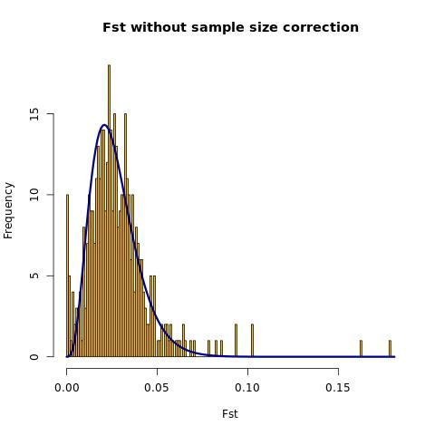
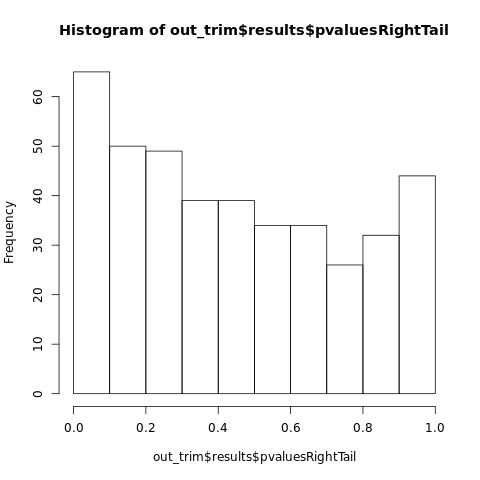
The p-value should be more or less flat and the distribution of F<sub>ST</sub> about normal.

#### Run OutFLANK on all SNPs, corrected by the trimmed dataset
```R
P1 <- pOutlierFinderChiSqNoCorr(my_fst, Fstbar = out_trim$FSTNoCorrbar, dfInferred = out_trim$dfInferred, qthreshold = 0.05, Hmin = 0.1)
head(P1)

# we need to add the chromosome/position info for plotting. the left_join function in dplyr is super useful to match differebnt table
library(dplyr)
P1_pos <- dplyr::left_join(P1, chr_pos, by = c("LocusName" = "id_snp"))

# We can have a look at the results by exporting the figures
# we can look at the FST as a function of heterozygosity to understand which snps have been evaluated, which one appear true or false outliers
#And we can look along the genome with our manhattan plots

jpeg("04_outflank/outflank_outlier_fst_He.jpeg")
ggplot(P1_pos, aes(x = He, y = FST, colour = OutlierFlag)) + 
  geom_point()+
  theme_classic()
 dev.off()

# note that we divide here position by 1000000 so the scale is in MB
jpeg("04_outflank/outflank_outlier_fst.jpeg")
ggplot(P1_pos, aes(x = position / 1000000, y = FST, colour = OutlierFlag)) + 
  geom_point()+
  theme_classic()+
  facet_grid(cols = vars(chromosome), scales = "free_x", space = "free_x") +
  labs(x = "position (in MB)")
 dev.off()

# It may also be easier to export the matrix and play in Rstudio
write.table(P1_pos, "04_outflank/outflank_fst_outliers.txt", sep = "\t", row.names = FALSE, quote = FALSE)
```
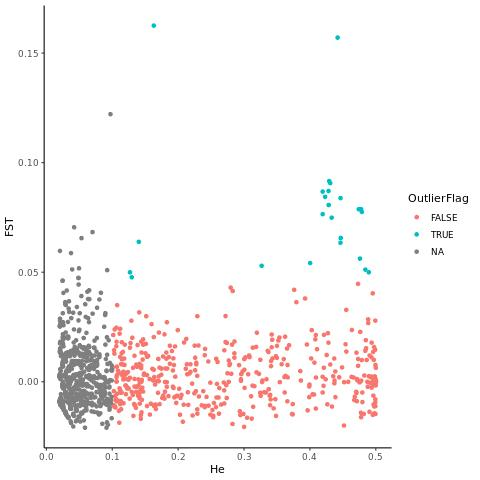
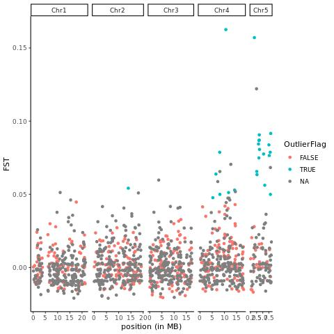

What do you see?

Lots of outliers are located on chr5, and/or chr4... Are we really surprised by this observation?

Let's remember that we are analyzing a species with extremely high gene flow. Moreover, we are looking here at outliers F<sub>ST</sub> across all populations (without giving any geographic or environmental information). There is high genetic differentiation between the two sexes, and we have unbalanced sex-ratio in the sampling: this is probably driving the signal on chr 5. But there are also possibly adaptive loci on sex chromosomes... 

What about chr 4? It may be that the chromosomal rearrangement is involved in local adaptation, or it is particularly divergent, and small fluctuations of frequency between populations are driving the signal?

Should we put a different threshold for F<sub>ST</sub> outliers between different regions of the genome? And how to do it? This is an open question at the moment.

There is accumulating literature suggesting that recombination is a very important factor, which may both create spurious effects, leading even under neutrality to high F<sub>ST</sub> variance but also, biological effects by promoting clustering of adaptive loci, without mentioning the matter of linked selection or recombination...

**Optional:** You may want to re-run the analysis on the SNP subset without chr4/chr5 to get a sense of what that says.

### 3-2.2 With BayPass
To look at adaptive differentiation and environmental associations, we wil use [BayPass](http://www1.montpellier.inra.fr/CBGP/software/baypass/). The publication is here https://www.genetics.org/content/201/4/1555. 
>Mathieu Gautier. GENETICS December 1, 2015 vol. 201 no. 4 1555-1579; https://doi.org/10.1534/genetics.115.181453

You can find a good manual [here](http://www1.montpellier.inra.fr/CBGP/software/baypass/files/BayPass_manual_2.2.pdf).

This package is an extension of the software [Bayenv](https://gcbias.org/bayenv/). It may be a little long to run so you will have time to skim the manual for more details. There are different underlying bayesian models, and we will just run the default mode but you may want to explore a bit further in the future.

#### Prepare files
To save time today, we will use the Toolbox package developed by Yann Dorant. You may be interested in looking at the scripts to understand how this is done.

This Toolbox embeds various useful scripts in order to quickly convert VCF format to common pop genomics formats (genepop, StAMPP, BayPass, bayenv...). If you are interested to learn more about this toolbox, you will find the full description at https://gitlab.com/YDorant/Toolbox

(*If not done already*) To download the Toolbox in your current working directory on the server (`03_day3`), use the following command line:
```bash
git clone https://gitlab.com/YDorant/Toolbox
```

Ok, now we are ready to convert our VCF files to the BayPass format. The toolbox has an easy way to do that with a bash script. This bash script requires four arguments:
* -v VCF file
* -p population map
* -f output file format
* -o output prefix name

```bash
python3 Toolbox/reshaper_baypass.py 02_data/canada.vcf 02_data/popmap_canada.txt 05_baypass/canada.baypass

python3 Toolbox/reshaper_baypass.py 02_data/canada.pruned.recode.vcf 02_data/popmap_canada.txt 05_baypass/canada.pruned.baypass

# confirm the files were created 
ls 05_baypass/
```

#### Run BayPass controlled for population structure

Then test that BayPass is well referenced for your session by typing `g_baypass`. This will give you :
```bash
BayPass Version 2.3
Reading and checking input data
ERROR: Please provide a genotyping file
```
Now we are ready to run BayPass!

We want to pinpoint the outlier SNPs that differ from the basic structure of the population. This is not a big deal in our example but it may be in other study systems.

Best practices suggest to first run BayPass on the LD-pruned VCF file, extract the covariance matrix between populations (`mat_omega`), and then use it as a covariate in the BayPass model. This will take a few minutes to run:

```bash
# activate the conda environment
conda activate adaptg

# run on pruned snps
g_baypass -npop 12 -gfile 05_baypass/canada.pruned.baypass -outprefix 05_baypass/prunedsnps.output -nthreads 2

# controlled run
g_baypass -npop 12 -gfile 05_baypass/canada.baypass \
-omegafile 05_baypass/prunedsnps.output_mat_omega.out \
-outprefix 05_baypass/allsnps.controlled.output -nthreads 2
```
Now copy the controlled output on your local computer. We can have a look at the output. the most important are the omega matrix, which is covariance between populations and the XtX value which represent a kind of value associated to each SNP. the higher it gets, the more this snps differentiate the populations.

If we don't want to control for population structure, we could have run it directly (**please do not run now**) with `g_baypass -npop 12 -gfile 05_baypass/canada.baypass -outprefix 05_baypass/allsnps.output -nthreads 1`.

#### Set a threshold for the XtX value
While this runs, we can prepare our subsequent analysis. We need to know above which XtX threshold value we can consider a locus to be an outlier of population differentiation.

To look for that, the authors suggest to simulate a neutral distribution with a small R function, run BayPass on the simulated genotypes, and extract the distribution of XtX values. We can then chose a threshold of the 95% quantile, 99% quantile, etc. 

To do so we have simulated genotypes in R using a program provided with BayPass.

We did that for you to save some time and the file is here `05_baypass/G.simulates_pods`.

If you want to see how to do, the code is here.
[simulate_baypass](00_documents/simulate_baypass.md) 

```bash
# controlled run on the simu dataset
g_baypass -npop 12 -gfile 05_baypass/G.simulates_pods \
-omegafile 05_baypass/prunedsnps.output_mat_omega.out \
-outprefix 05_baypass/simulate_controlled.output -nthreads 1
```
Let's copy the output of the simulated dataset on your local computer for visualization.


#### Visualize results in Rstudio on your local computer
If you are curious, you can explore the different file, look at the omega matrix, etc, which will be more or less like the pairwise fst matrix that we look at earlier. We will focus on the XtX values:
```R
# load package
library(ggplot2)

# load XtX values
xtx_allsnps <- read.table("05_baypass/allsnps.controlled.output_summary_pi_xtx.out", header = TRUE)
head(xtx_allsnps)
# we will mostly work with M_XtX

# load position info about the SNPs
SNP_pos <- read.table("02_data/SNP_pos.txt", header = TRUE)
# should be same number of rows
dim(xtx_allsnps)
dim(SNP_pos)

xtx_pos <- cbind(SNP_pos, xtx_allsnps)

ggplot(xtx_pos, aes(x = position, y = M_XtX, colour = chromosome)) + 
  geom_point() +
  theme_classic() +
  facet_grid(cols = vars(chromosome), scales = "free_x", space = "free_x")
```
Now we realised that we really need to know at which value we put the threshold:
```R
# load XtX values from simulatd data
xtx_simu <- read.table("05_baypass/simulate_controlled.output_summary_pi_xtx.out", header = TRUE)
head(xtx_simu)

# calculate the threshold
threshold_fdr0.01 = quantile(xtx_simu$M_XtX, probs = 0.99)
threshold_fdr0.05 = quantile(xtx_simu$M_XtX, probs = 0.95)

# add it on the plot
ggplot(xtx_pos, aes(x = position, y = M_XtX, colour = chromosome)) + 
  geom_point() +
  theme_classic() +
  facet_grid(cols = vars(chromosome), scales = "free_x", space = "free_x") +
  geom_hline(aes(yintercept = threshold_fdr0.05), linetype = "dotted", linewidth = 1, col = "red", show.legend = FALSE) +
  geom_hline(aes(yintercept = threshold_fdr0.01), linetype = "dotted", linewidth = 1, show.legend = FALSE)

# output outliers
xtx_pos[xtx_pos$M_XtX >= threshold_fdr0.05, ]
```

Here are the results for the analysis controlled by population structure (that you did, following best practices) and what you could have done without controlling (appropriate under certain circunstanes). Compare the results. What do you think? 
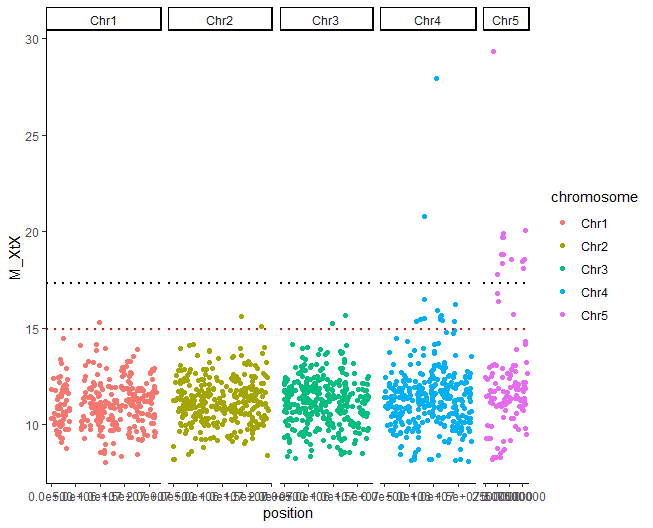
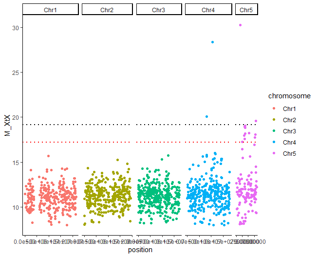

Note that repeating BayPass runs may lead to slightly different results. That means that your plot may differ from mine, and that in real life, you may want to run it 5 times and keep the median value of XtX.

For best results, it is recommended to make several independant runs and take the median value for XtX or BF.

>We don't have time and resource to do that today, but you can try for your data with a loop and random starting seed (**please do not run it now**):
```bash
# run model for 5 repetitions
for i in 1 2 3 4 5 
do
seed = $((1000 + RANDOM % 9999)) # set random seed
echo "$seed"
g_baypass -npop $N_pop -gfile $geno -efile $env -omegafile $omega_mat -outprefix output"$i" -nthreads $N_CPU -npilot 25 -burnin 5000 -seed $seed
done
```


# Tutorial 2

## 3-3. Genotype-Environment Associations
### 3-3.1 With BayPass (locus by locus)
BayPass can also test for correlations between the genotypic data and environmental or pehnotypic data.

This means that we will no longer look at overall average differentiation between populations, but test whether allele frequencies at each given SNP are correlated with phenotypic or environmental variation. With this approach, we can identify SNPs that are associated with a given phenotype or an enviornmental variable. 

To test for environnmental associations with BayPass, we will use the same script as before and just add the `-efile` option to provide a file summarizing environmental variation.

#### Get environmental data and format env file 
Today we will test for correlations between genotypes and temperature, which we have extracted for each population location from the database MarSPEC (for marine environments). BioOracle is another good option for marine environments, whereas WorldClim is a commonly used database for terrestrial environments. 

Here is an example script to extract environmental variables for each location of interest: [extract clim variables](tutorial_worldclim_optional.R). (**This script is not working at the moment, but an updated version will be provided later in the week**).

The format of the environmental data file is one row for each environmenral variable and one column for each population location, without header.
We have used the file `02_data/info_pop_geo_eco.txt` as input and format it in R to produce the file `05_baypass/env.txt`.

We also need to make sure that our env file is exactly in the same order as the population are in the geno file.

Now we can run BayPass with the environment file on both the real dataset and the simulated dataset.

Here is the example with the covariate matrix controlling for a possible underlying structure but depending on your system you may want to control or not, or do both to compare (to remove the control by population structure, just remove `-omegafile 05_baypass/prunedsnps.output_mat_omega.out`).

This may take a few minutes:
```bash
# do not forget to activate the conda environment
conda activate adaptg

# continue the analysis
cd 03_day3

g_baypass -npop 12 -gfile 05_baypass/G.simulates_pods \
-efile 05_baypass/env.txt \
-omegafile 05_baypass/prunedsnps.output_mat_omega.out \
-outprefix 05_baypass/simulate_env.controlled.output -scalecov -nthreads 2

g_baypass -npop 12 -gfile 05_baypass/canada.baypass \
-efile 05_baypass/env.txt \
-omegafile 05_baypass/prunedsnps.output_mat_omega.out \
-outprefix 05_baypass/allsnps_env.controlled.output -scalecov -nthreads 1

```

#### Visualise results in Rstudio on your local computer
Like we did before we can plot the XtX but we will mostly be interested in the BF value (Bayesian factor of association with an environmental variable). You will find it in the files ending with `betai_reg.out` in the column BF.dB.
"the Bayes Factor (column BF(dB)) in dB units (i.e., 10 × log10(BF)) measuring the support of the association of each SNP with each population covariable and the corresponding regression coefficients βi (column Beta_is)"
BF can be informative in itself, good candidate are usually above 20. 
Following the rule of Jeffrey, we can consider BF as meaning
* < 3 --> nothing
* 3 to 10 --> weak support
* 10 to 20 --> interesting
* more than 20 --> strong support

>See Jeffreys, H. (1961). Theory of probability (3rd ed.). Oxford: Oxford University Press, Clarendon Press. https://global.oup.com/academic/product/theory-of-probability-9780198503682?cc=ca&lang=en&
> and Robert E. Kass & Adrian E. Raftery (1995): Bayes Factors, Journal of the American Statistical Association, 90:430, 773-795 http://dx.doi.org/10.1080/01621459.1995.10476572

We can also find a threshold from the run on simulated data.
We will let you have a look at those data and plot BF along the genome re-using the same code as before.

What do you observe? 

- Uncontrolled model

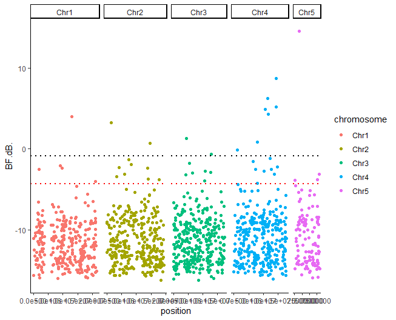

- Controlled model

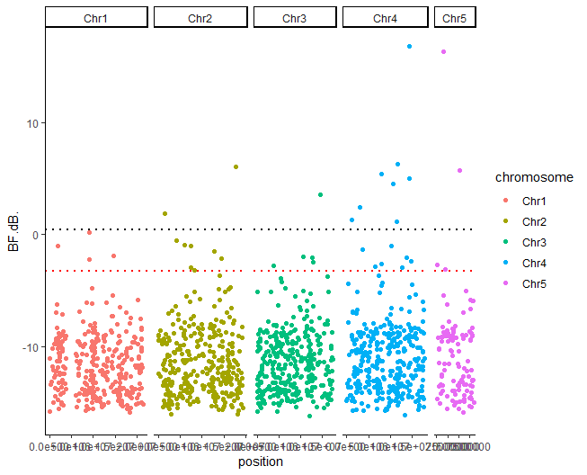

In the dataset we analized today we find very few putative outlier SNPs associated with temperature. It may be that 1) we don't have the power to detect significant associations, 2) we have only 12 populations and 3) a reduced representation of the genome, and 4) given the presence of high gene flow among populations, very few regions of the genome are under selection that is strong enough to result in detectable differences in allelic frequencies among populations exposed to different temperatures.

We can export the list of outlier SNPs for subsequent analysis on day 5. Here is the code for the controlled models.
```R
# load bf values
bf_allsnps <- read.table("05_baypass/allsnps_env.controlled.output_summary_betai_reg.out", header = TRUE)
bf_pos <- cbind(SNP_pos, bf_allsnps)

# load bf values from simulatd data
bf_simu <- read.table("05_baypass/simulate_env.controlled.output_summary_betai_reg.out", header = TRUE)

# calculate the threshold from simulations (or you can use BF = 10)
threshold_fdr0.01 = quantile(bf_simu$BF.dB, probs = 0.99)
threshold_fdr0.05 = quantile(bf_simu$BF.dB, probs = 0.95)

outliers <- bf_pos[bf_pos$BF.dB >= threshold_fdr0.05, ]
write.table(outliers, "05_baypass/outlier_temp_bp.txt", row.names = FALSE, quote = FALSE, sep = "\t")
```

### 3-3.2 With Redundancy Analysis (RDA) (multi-loci)
Until now we have looked for signatures of selection one locus at a time. This is a design that is more likely to point to strong selective sweeps, large-effect loci, and/or large islands of divergence. Yet, most adaptation is expected to be polygenic and genome-scans may not be the best option to tackle this problem. However, RDA considers the whole genetic variance, the geographic variation in the environment and/or phenotypic variation all at once, and for this reason, it represents a better tool than what we've seen so far in the course. 

Again, we can also used the RDA to identify putative candidate.
Today we will follow a tutorial accompanying this paper https://onlinelibrary.wiley.com/doi/abs/10.1111/mec.14584 

>Forester, BR, Lasky, JR, Wagner, HH, Urban, DL. Comparing methods for detecting multilocus adaptation with multivariate genotype–environment associations. Mol Ecol. 2018; 27: 2215– 2233. https://doi.org/10.1111/mec.14584

Which has a super nice vignette that you can check here https://popgen.nescent.org/2018-03-27_RDA_GEA.html. 

Our tutorial will be pretty simple compared to this one because we're going test for associations with only one environmental variable, that is temperature. We encourage you to explore the Forester's tutorial in detail as it provides more details. Also, we would recommend two more papers on RDA and their application in real studies. The first is a follow-up from Forester's et al. (2018), which is also accompanied by a tutorial (for more advanced users we would say)
>Capblancq, T. and Forester, B.R., 2021. Redundancy analysis: A Swiss Army Knife for landscape genomics. Methods in Ecology and Evolution, 12(12), pp.2298-2309.

With tutorial stored here https://github.com/Capblancq/RDA-landscape-genomics

Finally, this is a great example of a landscape genomics study from one of those authors, showing the application of the method, how to report the results, and, most important, how to estimates 'genomic offsets' and the adaptive potential of populations based on climate change scenarios.
>Capblancq, T., Morin, X., Gueguen, M., Renaud, J., Lobreaux, S. and Bazin, E., 2020. Climate‐associated genetic variation in Fagus sylvatica and potential responses to climate change in the French Alps. Journal of Evolutionary Biology, 33(6), pp.783-796.

Today, we will do most of the computational work of the RDA on the server (in R) but you could probably also run it locally, it is usually quite fast.

#### Prepare data 
RDA takes a matrix of genotypes (0, 1, 2) with as many rows as samples and as many columns as loci. As RDA doesn't allow any missing data, we’ll use a simple approach fill in the blanks: we will substitute missing genotypes with the most common genotype at each SNP across all individuals. As we've already started to discuss on Monday, the more missing data, the more you will introduce 'fake' data, which, if too many, can bias your results and create spurious associations. 

The imputation will follow the same approach that we used yesterday for the PCA. We can also use the genotype matrix that we exported earlier from vcfR, and the associated SNP_pos file.

Let's open R in the Terminal:
```R
geno <- read.table("02_data/geno_matrix.txt")
SNP_pos <- read.table("02_data/SNP_pos.txt", header = TRUE)

# transpose data and give meaningful colnames
gen <- t(geno)
colnames(gen) <- paste(SNP_pos$chromosome, SNP_pos$position, sep = "_")
gen [1:10, 1:10]

# replace 9 by NA
gen[which(gen == "9")] <- NA
# evaluate % of missing
sum(is.na(gen))/(dim(gen)[1]*dim(gen)[2]) # <3% of missing data
# impute missing with the most common geno
gen.imp <- apply(gen, 2, function(x) replace(x, is.na(x), as.numeric(names(which.max(table(x))))))
sum(is.na(gen.imp)) # No NAs
```
Let's look now at our environmental/pheno matrix. 
```R
info <- read.table("02_data/info_samples_canada.txt", header = TRUE)
head(info)
```

#### Run RDA on environmental variable and test it 
The code to run a RDA is quite simple:
```R
# load package
library(vegan)
# run rda
temp.rda <- vegan::rda(gen.imp ~ info$temperature, scale = TRUE)
temp.rda
```
Since we have only one variable, only RDA1 (the 1st axis) is meaningful.

We can look at the fraction of variance explained by this RDA with:
```R
RsquareAdj(temp.rda)
```
and then test the significance of the model using permutation tests. 
```R
temp.signif.full <- anova.cca(temp.rda, parallel = getOption("mc.cores")) # default is permutation = 999
temp.signif.full
```
As you can see, temperature does not explain a large fraction of total variance (0.1%!!) but the model appears significant nonetheless. It likely means that very few loci covary with temperature and that this factor does not explain a large fraction of genetic variation as a whole. This is expected as most SNPs will likely be neutral or controlling a miryad of other traits.

Yet, this formal test allows us to reject the null hypothesis that no linear relationship exists between the SNP data and the environmental factor.

#### Analyse the RDA output
We can plot the RDA. As we have only one informative RDA1, this will not be super informative.
We’ll start with simple triplots from vegan. Here we’ll use scaling=3 (also known as “symmetrical scaling”) for the ordination plots. This scales the SNP and individual scores by the square root of the eigenvalues so that we can easily visualize them in the sample plot.
Here, the SNPs are in red (in the center of each plot), and the individuals are colour-coded by population. The blue vectors are the environmental predictors. The relative arrangement of these items in the ordination space reflects their relationship with the ordination axes, which are linear combinations of the predictor variables.

```R
jpeg("06_rda/rda1_triplot.jpeg")
plot(temp.rda, scaling = 3) 
points(temp.rda, display = "sites", pch = 20, cex = 1.3, col = as.factor(info$pop), scaling = 3)
dev.off()
```

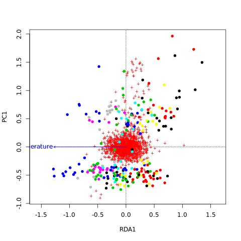

RDA2 is meaningless and samples are dispersed along RDA1 which represent temperature.

We can now use the loadings of the SNPs in  the ordination space to determine which SNPs are candidates for local adaptation. The SNP loadings are stored as "species" in the RDA object. We’ll extract the SNP loadings from RDA1 (choices is for which RDA axis we want) and extract the ones that are in the tail of this distribution. The most frequently used cut-off is 3SD (standard deviation) but you can choose to be more stringent or more inclusive depending on your objectives.

Here we chose a very low cut-off of 2, which will likely include false positives but we want to have enough outliers to be able to perform gene ontology enrichment analyses tomorrow and to look at the overlap with BayPass
- 2 (p=0.05)
- 2.25 (p=0.025)
- 2.5 (p=0.01)
- 2.75 (p=0.006)
- 3 (p=0.0027)
- 3.25 (p=0.001)
- 3.5 (p=0.0005)


```R
load.temp.rda <- scores(temp.rda, choices = c(1), display = "species") 

# load info about snps
SNP_pos <- read.table("02_data/SNP_pos.txt", header = TRUE)
load.temp.rda.pos <- cbind(SNP_pos, load.temp.rda)
head(load.temp.rda.pos)

# plot distribution
jpeg("06_rda/rda1_loading_hist.jpeg")
hist(load.temp.rda.pos$RDA1, main = "Loadings on RDA1")
dev.off()

# chose the sd limit
z = 2
lim_min <- mean(load.temp.rda.pos$RDA1) - ( z * sd(load.temp.rda.pos$RDA1))
lim_max <- mean(load.temp.rda.pos$RDA1) + ( z * sd(load.temp.rda.pos$RDA1))

# outliers
outlier_temp <- load.temp.rda.pos[load.temp.rda.pos$RDA1 >= lim_max | load.temp.rda.pos$RDA1 <= lim_min, ]
outlier_temp

# export them
write.table(outlier_temp, "06_rda/outlier_temp_rda.txt", row.names = FALSE, quote = FALSE, sep = "\t")

```
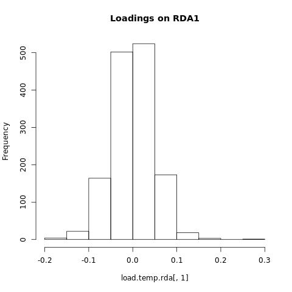

We may also visualize the RDA loadings along the genome:
```R
# load package
library(ggplot2)

# plot
jpeg("06_rda/loading_temp_manhattanplot.jpeg")
ggplot(load.temp.rda.pos, aes(x = position, y = RDA1, colour = chromosome)) + 
  geom_point() +
  theme_classic() +
  facet_grid(cols = vars(chromosome), scales = "free_x", space = "free_x") +
  geom_hline(aes(yintercept =lim_min), linetype = "dotted", linewidth = 1, show.legend = FALSE) +
  geom_hline(aes(yintercept = lim_max), linetype = "dotted", linewidth = 1, show.legend = FALSE)
 dev.off()

```

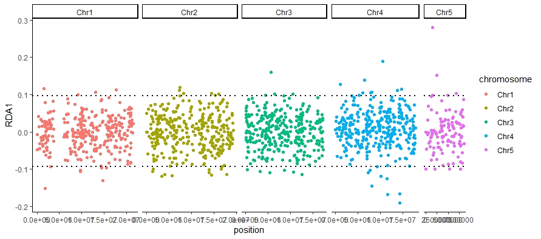

As with BayPass, we have very few outliers associated with temperature. Yet, their signal is quite strong so they are likely worth exploring a little more.

In our system in which gene flow is super high and geographic structure very low, it is not recommended to control the RDA by geography or population structure. Yet, as a proof of principle, you can explore how to do it in this complementary tutorial.

[Complementary RDA tutorial](00_documents/RDA.md)

### Identify outliers detected by two different methods
It is often recommended to keep only outliers (or SNPs with strong GEA) detected by more than one method to avoid false positive. This will nevertheless also reduce the power of the analysis... a matter of choice? Here we will run a few R command to keep the intersection of our BayPass and RDA outliers. It is worth noting that since RDA and BayPass works differently, it may not be surprising to have a limited overlap.

You can run that in Rstudio on your computer if you copy the outliers files into their respective folders. We will also make a Venn-diagram:

```R
# load package
library(dplyr)

# load outliers tables
outlier_temp_rda <- read.table("06_rda/outlier_temp_rda.txt", header = TRUE)
head(outlier_temp_rda)
nRDA <- dim(outlier_temp_rda)[1]
nRDA # how many outliers?

outlier_temp_bp <- read.table("05_baypass/outlier_temp_bp.txt", header = TRUE)
head(outlier_temp_bp)
outlier_temp_bp <- outlier_temp_bp[, c(1, 2, 3, 8)] # we keep snp id, chr, pos and BF
dim(outlier_temp_bp)
nBP <- dim(outlier_temp_bp)[1]
nBP # how many outliers?

# join outliers keeping positions present in either the 1st or the 2nd database (or both)
outlier_temp_fulljoin <- dplyr::full_join(outlier_temp_rda, outlier_temp_bp)
head(outlier_temp_fulljoin)
nALL <- dim(outlier_temp_fulljoin)[1]
nALL # how many in total?

# join outliers keeping positions present in either the 1st or the 2nd database (or both)
outlier_temp_innerjoin <- dplyr::inner_join(outlier_temp_rda, outlier_temp_bp)
head(outlier_temp_innerjoin)
dim(outlier_temp_innerjoin)
nboth <- dim(outlier_temp_innerjoin)[1]
nboth # how many joint outliers?

# visualize
library(ggVennDiagram)
ggVennDiagram(list(rda = 1:nRDA, BP = (nRDA + 1 - nboth):(nRDA - nboth + nBP)))

```
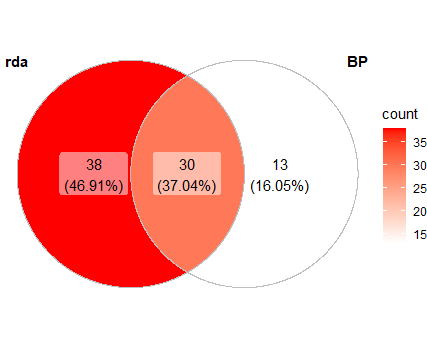
