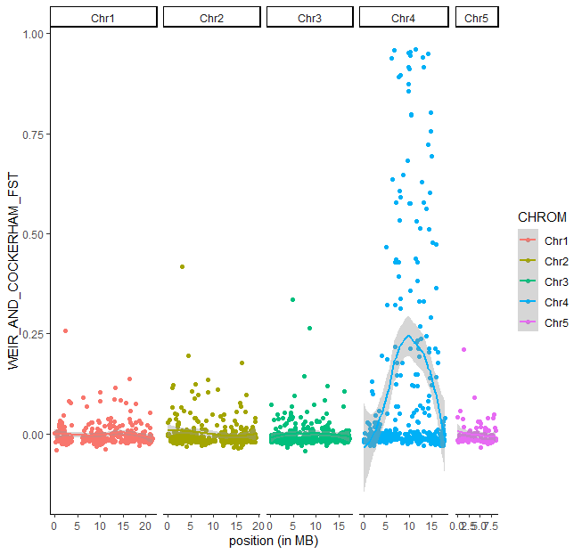

#### On the server: get F<sub>ST</sub> and windowed F<sub>ST</sub> by windows
```bash
# run vcftools for each each group of individuals AA, AB and BB
vcftools --vcf 02_data/canada.vcf --weir-fst-pop 02_data/AA.list --weir-fst-pop 02_data/AB.list --out 04_divergence/AA_AB

vcftools --vcf 02_data/canada.vcf --weir-fst-pop 02_data/AA.list --weir-fst-pop 02_data/BB.list --out 04_divergence/AA_BB

vcftools --vcf 02_data/canada.vcf --weir-fst-pop 02_data/AB.list --weir-fst-pop 02_data/BB.list --out 04_divergence/AB_BB
```

We can also do it by windows:
```bash
# set the window size to 100000 bp and window step to 25000 bp. the window step will tell VCFtools to advance 25 kb along the chromosome to start a new 100kb window, such that consecutive windows will overlap by 100000-25000 bps.
WINDOW=100000
WINDOW_STEP=25000

vcftools --vcf 02_data/canada.vcf --weir-fst-pop 02_data/AA.list --weir-fst-pop 02_data/AB.list --fst-window-size $WINDOW --fst-window-step $WINDOW_STEP --out 04_divergence/AA_AB

vcftools --vcf 02_data/canada.vcf --weir-fst-pop 02_data/AA.list --weir-fst-pop 02_data/BB.list --fst-window-size $WINDOW --fst-window-step $WINDOW_STEP --out 04_divergence/AA_BB

vcftools --vcf 02_data/canada.vcf --weir-fst-pop 02_data/AB.list --weir-fst-pop 02_data/BB.list --fst-window-size $WINDOW --fst-window-step $WINDOW_STEP --out 04_divergence/AB_BB
```

#### On your computer: visualize

```R
# load data
AA_BB <- read.table("04_divergence/AA_BB.weir.fst", header = TRUE)
head(AA_BB)

# plot Fst between AA and BB individuals
ggplot(AA_BB, aes(x = POS / 1000000, y = WEIR_AND_COCKERHAM_FST, col = CHROM)) +
  geom_point() + geom_smooth() +
  theme_classic() +
  facet_grid(cols = vars(CHROM), scales = "free_x", space = "free_x") +
  labs(x = "position (in MB)")

```

As you can note within our region of interest on chromosome 4, some SNPs have very high F<sub>ST</sub> (up to 1), suggesting fixed alleles and extremely high differentiation.
You may have noticed that some F<sub>ST</sub> values are negative. This is likely driven by very low frequency alleles and inbalanced sample sizes. We also observe NA in the calculation of F<sub>ST</sub> by site.

Try to plot also the AA vs AB and AB vs BB contrasts. 

We can also plot F<sub>ST</sub> values summarized by window.

```R
# load data
AA_BB.win <- read.table("04_divergence/AA_BB.windowed.weir.fst", header = TRUE)
head(AA_BB.win)

# calculate the position of the mid window
AA_BB.win$BIN_MID <- (AA_BB.win$BIN_START + AA_BB.win$BIN_END) / 2

# plot windowed Fst between AA and BB individuals
ggplot(AA_BB.win, aes(x = BIN_MID / 1000000, y = MEAN_FST, col = CHROM)) +
  geom_point() + geom_smooth() +
  theme_classic() +
  facet_grid(cols = vars(CHROM), scales = "free_x", space = "free_x") +
  labs(x = "position (in MB)")
```
We will keep a list of outlier SNPs that show the highest differentiation between the haplotypes. Because BB is a small group, highly differented SNPs between AA vs BB may be false outliers. We will thus rather extract the SNPs with the highest F<sub>ST</sub> between AA and AB instead, since AB comprises more indiviudals. Here we consider an outlier SNP one showing F<sub>ST</sub> above 0.1.

```R
# load file containing Fst between AA and AB
AA_AB <- read.table("04_divergence/AA_AB.weir.fst", header = TRUE)
head(AA_AB)

# find outlier SNPs as ones with Fst > 0.1 between groups
outlier_Chr4 <- AA_AB[AA_AB$WEIR_AND_COCKERHAM_FST >= 0.1, ]
write.table(outlier_Chr4, "04_divergence/outlier_Chr4.txt", row.names = FALSE, quote = FALSE, sep = "\t")
```
