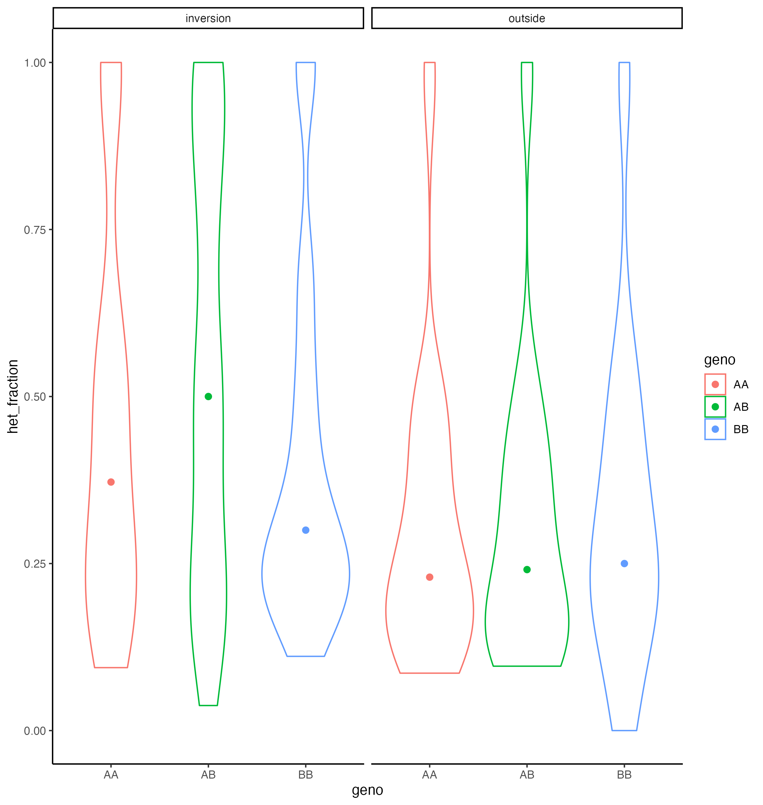

## Step 4 Studying heterozygosity

A typical signature of inversions or regions of supressed recombination is elevated heterozygosity among putative heterozygote individuals. We can test this by calculating heterozygosity within the AB group. We will use the `--hardy` options for VCFtools which tests [Hardy-Weinberg equilibrium](https://en.wikipedia.org/wiki/Hardy%E2%80%93Weinberg_principle) for each SNP and report the observed and expected fraction of heterozygotes at each position.

#### On the server: get H-W stats and number of heterozygotes
We will use VCFtools to create a VCF for each group:

```bash
# create vcf files containing only AA, BB and AB individuals
vcftools --vcf 02_data/canada.vcf --keep 02_data/AA.list --recode --out 02_data/AA

vcftools --vcf 02_data/canada.vcf --keep 02_data/AB.list --recode --out 02_data/AB

vcftools --vcf 02_data/canada.vcf --keep 02_data/BB.list --recode --out 02_data/BB

ls 02_data
```

We will only keep SNPs with MAF above 5% since rare SNPs will not be very informative about heterozygosity due to low sample size, i.e., values will likely be highly stochastic for rare SNPs

```bash
# filter VCF and retain sites with MAF > 5%
vcftools --vcf 02_data/BB.recode.vcf --maf 0.05 --hardy --out 05_heterozygosity/BB
vcftools --vcf 02_data/AB.recode.vcf --maf 0.05 --hardy --out 05_heterozygosity/AB
vcftools --vcf 02_data/AA.recode.vcf --maf 0.05 --hardy --out 05_heterozygosity/AA
```

You can look at the files `head 05_heterozygosity/AA.hwe`. As you see, some column headers have a `/` symbol, which will make it difficult to read this file into R. We will use a simple awk command to fix the headers.

```bash
# remve / symbols using awk
cat 05_heterozygosity/AA.hwe | awk -F"/" '$1=$1' OFS="\t" > 05_heterozygosity/AA_formatted.hwe

# check that the / symbol was removed correctly using head
head 05_heterozygosity/AA_formatted.hwe

cat 05_heterozygosity/AB.hwe | awk -F"/" '$1=$1' OFS="\t" > 05_heterozygosity/AB_formatted.hwe

cat 05_heterozygosity/BB.hwe | awk -F"/" '$1=$1' OFS="\t" > 05_heterozygosity/BB_formatted.hwe
```

#### On your local computer: visualize results
Please copy the outputs (`_formatted.hwe`) to your local computer in the folder `05_heterozygosity`. We will use Rstudio for the analysis.
We are only interested in the first three columns reporting the number of observed homozygotes and heterozygotes, but you may find useful to look at the remaining H-W statistics for other purposes.
After loading the data, we will calculate the % of heterozygotes and plot that along the genome using `ggplot()`.

```R
# load data
AB.hwe <- read.table("05_heterozygosity/AB_formatted.hwe", header = TRUE)

# rename columns
colnames(AB.hwe) <- c("CHR", "POS", "Homo1_obs", "Het_Obs", "Homo2_Obs", "Homo1_Exp", "Het_Exp","Homo2_Exp", "Chisq_HWE", "P_HWE", "P_HET_DEFICIT", "P_HET_EXCESS")
head(AB.hwe)

# calculate the fraction of observed heterozygotes
AB.hwe$het_fraction <- AB.hwe$Het_Obs / (AB.hwe$Homo1_obs + AB.hwe$Het_Obs + AB.hwe$Homo2_Obs)

# plot the fraction of heterozygotes along the chromosomes
ggplot(AB.hwe, aes(x = POS / 1000000, y = het_fraction, col = CHR)) +
  geom_point(alpha = 0.5) + geom_smooth() +
  theme_classic() +
  facet_grid(cols = vars(CHR), scales = "free_x", space = "free_x") +
  labs(x = "position (in MB)")
```
You can do the same for AA and BB groups. Visualise the three groups together.

```R
# keep genotype information before joining the three tables
BB.hwe$geno <- "BB"
AB.hwe$geno <- "AB"
AA.hwe$geno <- "AA"
all.hwe <- rbind(AA.hwe, AB.hwe, BB.hwe)
head(all.hwe)

# plot, colouring by genotype
ggplot(all.hwe, aes(x = POS / 1000000, y = het_fraction, group = geno, col = geno)) +
  geom_point(alpha = 0.5) + geom_smooth() +
  theme_classic() +
  facet_grid(cols = vars(CHR), scales = "free_x", space = "free_x") +
  labs(x = "position (in MB)")
```


Another way to visualize the data is using violin plots, and generating plots by chromosome and by genotype groups. If you want to do something more advanced, you can try a violin plot of the region inside the inversion vs. outside.

```R
# violin plot
ggplot(all.hwe, aes(x = geno, y = het_fraction, col = geno)) +
  geom_violin() +
  stat_summary(fun = median, geom = "point", size = 2) +
  facet_grid(cols = vars(CHR))+
  theme_classic()
```


```R
# plots inside and outside the inversion
library(tidyverse)

# define the breakpoint coordinates
left_breakpoint<-4.8*1e6
right_breakpoint<-16.6*1e6
chromosome_inversion<-"Chr4"

# create a data.frame with the SNPs inside the inversion
all.hwe.chr4.inversion<-all.hwe %>% filter(CHR==chromosome_inversion & POS >= left_breakpoint & POS <=right_breakpoint)

# find chromosome 4 SNPs that are not inside the inversion
# create a filtering vector with the SNP positions that are inside the inversion:
positions_in_inversion<-all.hwe.chr4.inversion$POS

# filter data.frame to only include the SNPs outside the inversion:
all.hwe.chr4.outside<-all.hwe %>% 
  filter(CHR==chromosome_inversion) %>% # keep SNPs in chromosome 4
  filter(!POS %in% positions_in_inversion) # keep SNPs not (!) in the vector of SNPs inside the inversion

# add a classifier to column location:
all.hwe.chr4.inversion$location <- NA
all.hwe.chr4.inversion$location <- "inversion"
all.hwe.chr4.outside$location <- "outside"

# merge data.frames:
all.hwe.chr4<-rbind(all.hwe.chr4.inversion, all.hwe.chr4.outside)

# plot. you can see that heterozigosity is higher inside the inversion,
ggplot(all.hwe.chr4, aes(x = geno, y = het_fraction, col = geno)) +
  geom_violin() +
  stat_summary(fun = median, geom = "point", size = 2) +
  facet_grid(cols = vars(location))+
  theme_classic()
```


