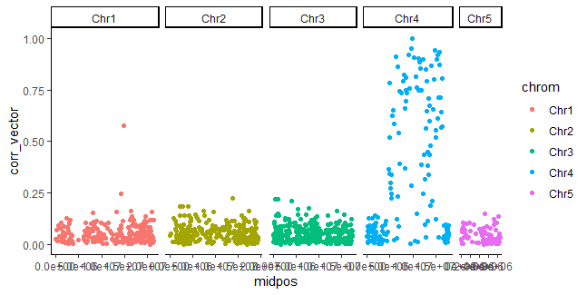
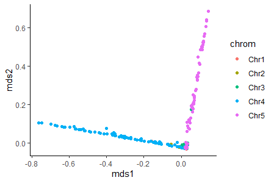
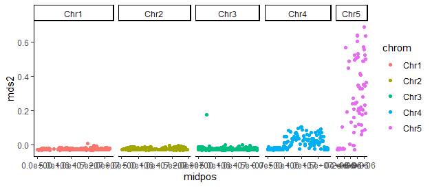
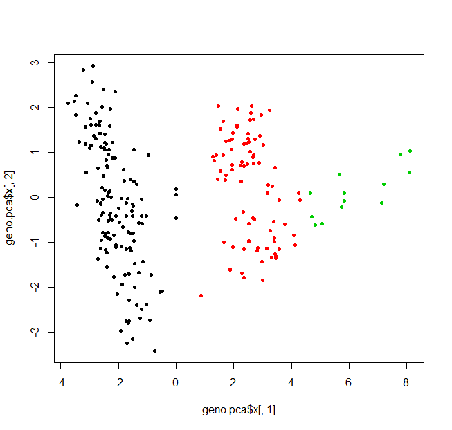
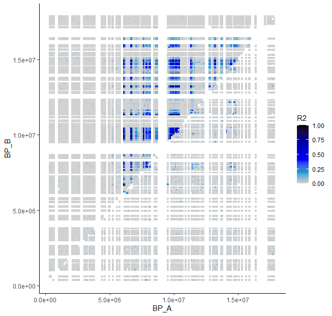
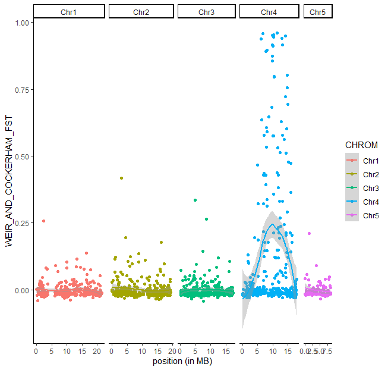
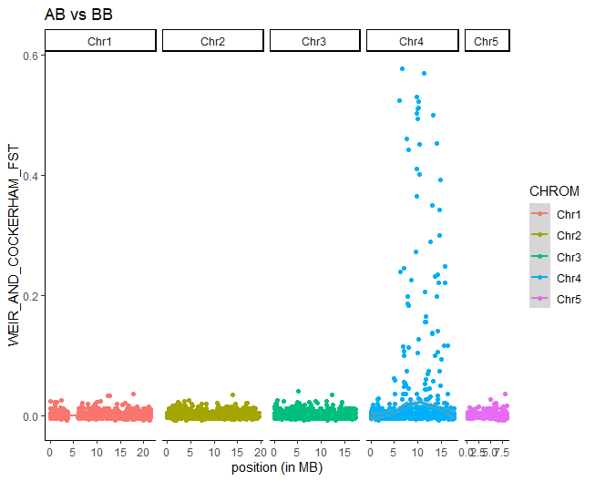
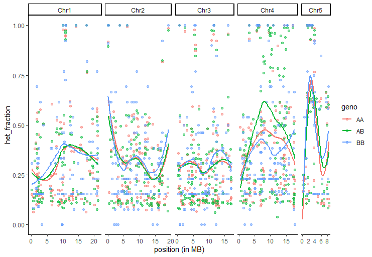
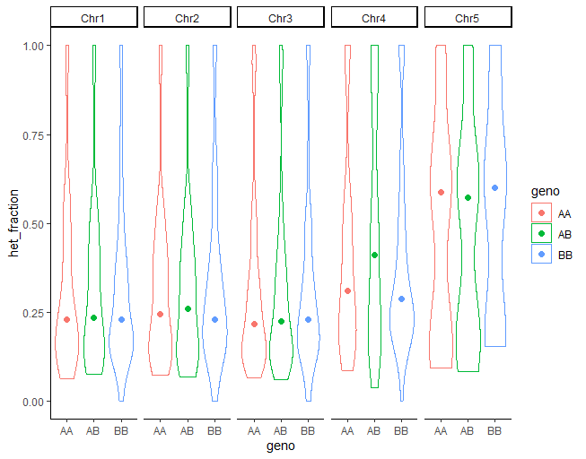

# Day 4. Tutorial on haploblocks <!-- omit from toc -->

## Table of contents <!-- omit from toc -->
- [4-1. Exploring differentiation heterogeneity across the genome and putative chromosomal rearrangements on Chr 4](#4-1-exploring-differentiation-heterogeneity-across-the-genome-and-putative-chromosomal-rearrangements-on-chr-4)
  - [Local PCA along the genome to detect non-recombining haploblocks](#local-pca-along-the-genome-to-detect-non-recombining-haploblocks)
    - [Prepare files](#prepare-files)
    - [Run lostruct (on the server)](#run-lostruct-on-the-server)
    - [Visualizing the local PCA outputs (on your computer in Rstudio)](#visualizing-the-local-pca-outputs-on-your-computer-in-rstudio)
  - [Using Multidimensional Scaling (MDS)](#using-multidimensional-scaling-mds)
  - [A note about running R on the command line](#a-note-about-running-r-on-the-command-line)
- [2. Explore the putative haploblock](#2-explore-the-putative-haploblock)
  - [Genotype the individuals for the haploblocks](#genotype-the-individuals-for-the-haploblocks)
  - [Study linkage disequilibrium (LD) in the haplobock region](#study-linkage-disequilibrium-ld-in-the-haplobock-region)
    - [On the server: Calculate LD with PLINK](#on-the-server-calculate-ld-with-plink)
    - [On your computer: Plotting LD](#on-your-computer-plotting-ld)
  - [Studying differentiation with FST (optional)](#studying-differentiation-with-fst-optional)
  - [(Optional) Studying heterozygosity with the % of heterozygotes in each genotype group](#optional-studying-heterozygosity-with-the--of-heterozygotes-in-each-genotype-group)
  - [About haploblocks](#about-haploblocks)


**IMPORTANT:** Please copy the folder `04_day4` from `~/Share` into you home directory on the AWS server. Please copy it also to your own computer and try to follow the same folder architecture when moving your files.

```bash
cd 
cp -r ~/Share/physalia_adaptation_course/04_day4 .
cd 04_day4/01_haploblocks
```
We will run all commands from this folder.

If not done already, enable the conda environment with `conda activate adaptg`.

## 4-1. Exploring differentiation heterogeneity across the genome and putative chromosomal rearrangements on Chr 4 

### Local PCA along the genome to detect non-recombining haploblocks
As you saw on day 2, the PCA performed on the 240 samples from the 12 populations from Canada displays a very unexpected pattern. The loadings indicate that some portions of the genome are overwhelmingly driving population structure, making us suspect there may be sex-linked markers and/or chromosomal rearrangements.

To get a better sense of what's going on, we will be running a PCA again, but along the genome using windows of X number of SNPs. For this we will use the R package [lostruct]( https://github.com/petrelharp/local_pca), presented in this [publication](https://www.genetics.org/content/211/1/289).

#### Prepare files
We will skip the preparation of the file and the 1st steps of lostruct to read and prepare the windows because R does not communicate with bcftools on the AWS and we want to save you time. So keep in mind that there are preparative steps if you want to re-do the analysis on your dataset: 

[Link to preliminary steps in_lostruct](~/04_day4/01_haploblocks/Step0_file_preparation.md)

Briefly, this analysis is more powerful if we keep all SNPs, including those in LD, so we will use the unfiltered VCF (before we even selected one random SNP per RAD locus) for the 12 canadian populations. We convert this file into BCF format. Then we use a function in lostruct to make windows of your chosen size. We suggest to use window of 100 SNPs since coverage of the genome is low (RAD data) and we don't have a lot of SNPs. Typically, with whole genome data you may first run windows of 1000 or 5000 SNPs for a first look, and then refine the analysis with smaller windows. The analysis can be run chromosome by chromosome (as in the paper) or on the entire genome. Here, we are going for the entire genome.

Then, lostruct runs the PCAs on each window. Here we choose to retain the first 2 PC (Principal Components: k = npc = 2) because they usually capture the most variance for each local PCA.

The output consists of a matrix in which each row gives the first k eigenvalues and k eigenvectors for each window. This gives you a matrix with 483 columns (3 columns of info, 240 columns with PC1 score for each individual, and 240 column with PC2 score for each individual). The matrix consists of as many rows as windows (1016 with windows of 100 SNPs). We added 3 columns of information about the window position. You can have a look at it with `less -S 00_localPCA/pca_matrix.txt` (escape `less` by pressing `q`).

#### Run lostruct (on the server)
We will run the final steps of the lostruct approach. You can do it either on the Terminal (start R) or in RStudio on your computer:
```R
# load libraries
library(data.table)
library(lostruct)

# load matrix
pca_matrix <- read.table("00_localPCA/pca_matrix.txt", sep = "\t", header = TRUE, stringsAsFactors = FALSE)
head(pca_matrix)
# split columns with positions information and PC
window_pos <- pca_matrix[, 1:3]
pcs <- as.matrix(pca_matrix[, 4:dim(pca_matrix)[2]])
```

The lostruct approach is based on the computation of pairwise distances between windows and their visualization with a MDS (multidimensional scaling). Our goal is to identify groups of windows that display similar PCA patterns. This is done with the following functions (we use the first two PCs per window as above, and will look at the first 10 axes of the MDS):
```R
pcdist <- pc_dist(pcs, npc = 2)
mds_axe <- cmdscale(pcdist, k = 10)
head(mds_axe)

# again the mds file is missing position information so let's fix that:
mds_matrix <- cbind(window_pos, mds_axe)
write.table(mds_matrix, "00_localPCA/mds_matrix.txt", sep = "\t", row.names = FALSE, quote = FALSE)
```
Since this will take some time, we can let it run and explore some of the local PCAs on your local computer with Rstudio. For this, download the files called `pca_matrix.txt` and `mds_matrix.txt` to your local computer.

#### Visualizing the local PCA outputs (on your computer in Rstudio)
On our local computer, we will use RStudio to visualize all those local PCAs. Set your working directory as `04_day4/01_haploblocks`, load required libraries (`ggplot2`), and the matrix of PCAs:
```R
# set the working directory
setwd("04_day4/01_haploblocks")
# load package
library(ggplot2)

# load pca matrix
pca_matrix <- read.table("00_localPCA/pca_matrix.txt", header = TRUE)
pca_matrix[1:10, 1:10]
n_windows <- dim(pca_matrix)[1] # the number of windows we have
```

We may want to simply plot the PCAs for some windows. This is a little difficult due to the tricky matrix format.

Look at the format. We have 3 columns to describe the coordinates of each window (total eigen values, eigvalue of PC1, eigvalue of of PC2), then 240 values for PC1 scores of all our samples, and 240 values for PC2 scores of all samples:
```R
   chrom   start     end      total    lam_1     lam_2   PC_1_L_01    PC_1_L_02    PC_1_L_03    PC_1_L_04
1   Chr1    4598  102627 11.2676700 2.237855 1.2467539  0.04757381  0.003211281  0.048236420 -0.029799279
2   Chr1  102627  298945  5.4675252 1.664517 1.1009505  0.05177397 -0.066433281  0.056306263  0.057187867
3   Chr1  298949  557448 20.3195707 3.514855 2.5803417 -0.07997331 -0.014285140 -0.077618567  0.061921540
4   Chr1  557463  664701  7.9826780 1.707709 1.4688195  0.00317093 -0.027442327 -0.003586276 -0.025939893
```

To get information for a particular window we can do the following:
```R
Nind <- 240
i = 15 # for the 15th window

pc1_i <- t(pca_matrix[i, 7:(Nind + 6)]) # scores along PC1
pc2_i <- t(pca_matrix[i, (Nind + 7):(2 * Nind + 6)]) # scores along PC2
var1 <- round(pca_matrix[i, 5] / pca_matrix[i, 4], 2) * 100 # % of variance explained by PC1
var2 <- round(pca_matrix[i, 6] / pca_matrix[i, 4], 2) * 100 # % of variance explained by PC2
midpos_i <- (pca_matrix[i, 2] + pca_matrix[i, 3]) / 2 # average position of the window
window_i <- paste(pca_matrix[i, 1], midpos_i , sep = "_") # paste the name of CHR and the midposition

plot(pc1_i, pc2_i, pch = 20, xlab = paste("PC1", var1, "%"), ylab = paste("PC2", var2, "%"), main = window_i)

```

Not super clean but it works. Building on that you can do anything to reformat your matrix of PC values, eigen values, etc...

We next want to know which windows explain the pattern observed in the global PCA where we first identified the three haplogroups. We can look at the correlation between the PCs of the global PCA analysis and PC1 of each local PCA. We propose to use the PCA performed on the 12 Canadian populations, and look at the correlation between PC1 of the global PCA and PC1 of each local PCA (then you can do the same with PC2 of the global PCA and PC1 of each local PCA...). To save some time, we placed the geno-transformed matrix inside your directory, so you don't have to generate it with VCFtools, but know that the `.012` file was generated exactly as shown on Day 2.

Below, you can find a very basic loop to store the correlation by windows. You can probably do something fancier :-).

Please note that we could also have used here the genotype correlation, for instance call 0/1 or 0/1/2 -the cluster observed on the global PCA- and then look for each SNP at the correlation between genotypes and genotype for the cluster identified:
```R
geno <- read.table("00_localPCA/canada.012")[, -1] # load geno
geno[1:6, 1:6] # check the geno matrix
global.pca <- prcomp(geno) # run the pca
plot(global.pca$x[, 1], global.pca$x[, 2]) # plot the pca
PC_of_interest <- global.pca$x[, 1] # if you want to look at correlation with PC1

# initialise the vector
corr_vector <- vector(length = n_windows)
# loop over windows to store correlation factor
for (i in 1 : n_windows) {
  pc1_i <- t(pca_matrix[i, 7:(Nind + 6)]) # scores along PC1
  corr_vector[i] <- abs(cor(PC_of_interest, pc1_i)[1, 1])
}

```
Let's now merge the correlation and position tables to do a Manhattan plot of correlations along the genome. We need to take a mid-position for each window in the local PCA.

For plotting we will use `ggplot2` and the `facet_grid()` feature to make a quick Manhattan plot with chromosomes side by side:
```R
# merge pca_matrix and corr_vector by column using c_bind()
pca_correlation <- cbind(pca_matrix[, 1:3], corr_vector)
# calculate mid position
pca_correlation$midpos <- (pca_correlation$start + pca_correlation$end) / 2
# check the file
head(pca_correlation)

# plot correlation across chromosomes
ggplot(pca_correlation, aes(x = midpos, y = corr_vector, colour = chrom)) +
  geom_point() +
  theme_classic() +
  facet_grid(cols = vars(chrom), scales = "free_x", space = "free_x")

```
>What do you see? Which windows correlate with PC1? What do you interpret from this?



Now you can have a look at the correlation between local PC1s and the global PC2.

### Using Multidimensional Scaling (MDS)
In the previous exercise, we knew in advance that there was probably an unusual signal on PC1 and PC2 of the local PCA. However, please keep in mind that, even if on the global PCA no region is driving a specific clustering, there may still be -on some chromosome, or some regions- similar clustering of individuals due to population structure, chromosomal rearragements, sex, non-recombining haploblocks, etc. Exploring the MDS is a good strategy to detect such heterogeneity in the genome.

Let's load the MDS and plot the first four axes:
```R
mds_matrix <- read.table("00_localPCA/mds_matrix.txt", header = TRUE)
head(mds_matrix)
mds_matrix$midpos <- (mds_matrix$start + mds_matrix$end) / 2

# for ggplot you need to rename the columns
colnames(mds_matrix) <- c("chrom", "start", "end", "mds1", "mds2", "mds3", "mds4", "mds5","mds6", "mds7", "mds8", "mds9", "mds10")

# plot mds_matrix MDS1 vs MDS2, coloring points by chromosome
ggplot(mds_matrix, aes(x = mds1, y = mds2, colour = chrom)) +
  geom_point() +
  theme_classic()

# plot mds_matrix MDS3 vs MDS4, coloring points by chromosome
ggplot(mds_matrix, aes(x = mds3, y = mds4, colour = chrom)) +
  geom_point() +
  theme_classic()

```
This is the output for MDS1 vs MDS2:


As you see, MDS1 and MDS2 are largely driven by Chr4 and Chr5. Let's look at the MDS scores along the genome to pinpoint the regions within chromosomes that are driving the signal.

Building on what we did before, you can generate a Manhattan plot with a mid-position as XX, and MDS1 or MDS2 as YY:
```R
# calculate the midpoint of the windows in the matrix
mds_matrix$midpos <- (mds_matrix$start + mds_matrix$end) / 2

# Manhattan plot of MDS1 along the chromosomes
ggplot(mds_matrix, aes(x = midpos, y = mds1, colour = chrom)) +
  geom_point() +
  theme_classic() +
  facet_grid(cols = vars(chrom), scales = "free_x", space = "free_x")

# Manhattan plot of MDS2 along the chromosomes 
ggplot(mds_matrix, aes(x = midpos, y = mds2, colour = chrom)) +
  geom_point() +
  theme_classic() +
  facet_grid(cols = vars(chrom), scales = "free_x", space = "free_x")

```

This is the output for MDS2:


To follow-up, you can try to find approximately the breakpoints of those areas that appear as outliers (*Hint: find the windows with high MDS scores*). These outliers are approximately located 4.8-16.6 Mbp on chromosome 4 and the full chromosome 5.

### A note about running R on the command line
Instead of running R interactively (by typing and executing commands one-by-one on the console, as we did for lostruct), we could have written an R script with all the commands, and execute it in one go using `Rscript`. Note that you can pass additional arguments from the console to the R script using `commandArgs()`:
```bash
Rscript my_cool_script.R [option1] [option2]
```
The first lines `my_cool_script.R` would be:
```R
argv <- commandArgs(TRUE)
option1 <- argv[1] # this variable captures the 1st parameter
option2 <- argv[2] # this variable captures the 2nd parameter
```

## 2. Explore the putative haploblock

### Genotype the individuals for the haploblocks
Thanks to our local PCA exploration on Day 2, we know that there are non-recombining haploblocks, which may be indicative of an inversion on chromosome 4.

We have located the breakpoints approximately at 4.8 Mbp to 16.6 Mbp. We can make a PCA based on variants in that region only and use k-means approaches to classify the individuals into the three possible genotypes for the inversion (homozygotes standard AA, heterozygotes AB, homozygotes inversion BB). 

To save time, you can find three lists `AA.list`, `AB.list` and `BB.list` in folder `02_data` containing the individuals for each genotype.

If you are interested in understanding how to perform the genotyping, you can have a look at this file
[extract_genotypes_from_pca](Step1_tuto.md).



### Study linkage disequilibrium (LD) in the haplobock region

#### On the server: Calculate LD with PLINK
To calculate LD between all pairs of SNPs using the data for all individuals in our dataset we will use [PLINK](https://www.cog-genomics.org/plink/).
We will remove SNPs at low frequency as they are not informative (>5% of frequency - we could have filter up to 5% or 10% with whole genome data). 
We will focus on chromosome 4 but feel free to try other chromosomes.

PLINK requires three input files (`.bed`, `.bim`, `.fam`). The argument `--r2` calculates LD as an R<sup>2</sup> correlation between the genotypes at pair of SNPs, `--inter-chr` makes a long matrix (`--square` would make a square one).
We need to add `--allow-extra-chromosome` since we are not working with human data and `--ld-window-r2 0` to require all output to be printed. To reduce the file you can choose here a minimum threshold for R<sup>2</sup>:
```bash
# unzip vcf
gunzip 02_data/canada.vcf.gz

# extract a reduced VCF containing all individuals
vcftools --vcf 02_data/canada.vcf --chr Chr4 --maf 0.05 --recode --out 03_ld/maf0.05_chr4

# format for PLINK
plink --vcf 03_ld/maf0.05_chr4.recode.vcf --make-bed --out 03_ld/maf0.05_chr4

# calculate LD
plink --bed 03_ld/maf0.05_chr4.bed \
--bim 03_ld/maf0.05_chr4.bim \
--fam 03_ld/maf0.05_chr4.fam \
--r2 inter-chr --allow-extra-chr --ld-window-r2 0 \
--out 03_ld/maf0.05_chr4

head 03_ld/maf0.05_chr4.ld
```

We want to compare LD calculated for all individuals combined versus LD *within* a group of homokaryotes (same as homozygotes but for inversions). In this case, we choose the group with most individuals, group AA.

We want to consider the same SNPs so we used the recoded VCF with MAF >5% above, but just keep the AA individuals using `--keep` in VCFtools.

```bash
# extract a reduced VCF file with the same SNPs but only AA individuals
vcftools --vcf 03_ld/maf0.05_chr4.recode.vcf --keep 02_data/AA.list --recode --out 03_ld/AA_maf0.05_chr4

# format for PLINK
plink --vcf 03_ld/AA_maf0.05_chr4.recode.vcf --make-bed --out 03_ld/AA_maf0.05_chr4

# calculate LD
plink --bed 03_ld/AA_maf0.05_chr4.bed \
--bim 03_ld/AA_maf0.05_chr4.bim \
--fam 03_ld/AA_maf0.05_chr4.fam \
--r2 inter-chr --allow-extra-chr --ld-window-r2 0 \
--out 03_ld/AA_maf0.05_chr4

head 03_ld/AA_maf0.05_chr4.ld

```


#### On your computer: Plotting LD

Please download the two files `.ld` to your local computer (in the `03_ld` folder).

In RStudio, to visualize the results use:
```R
# load package
library(ggplot2)

# load data
chr4.ld <- read.table("03_ld/maf0.05_chr4.ld", header = TRUE)
head(chr4.ld)

# plot (very simple solution with ggplots
ggplot(chr4.ld, aes(x = BP_A, y = BP_B, col = R2)) + theme_classic() + geom_point(size = 1, shape = 15) + 
  scale_colour_gradientn(colours = c("lightgrey", "deepskyblue3", "blue", "blue3", "navyblue", "black"), limits = c(0,1), name = "R2")
 
# load data for AA homozygotes
AA_chr4.ld <- read.table("03_ld/AA_maf0.05_chr4.ld", header = TRUE)
head(AA_chr4.ld)

# plot the LD values as a heatmap
ggplot(AA_chr4.ld, aes(x = BP_A, y = BP_B, col = R2)) + theme_classic() + geom_point(size = 1, shape = 15) + 
  scale_colour_gradientn(colours = c("lightgrey", "deepskyblue3", "blue", "blue3", "navyblue", "black"), limits = c(0,1),  name = "R2")

# plotting both heatmaps on the same graph:
ggplot(chr4.ld, aes(x = BP_A, y = BP_B, col = R2)) + theme_classic() + 
  geom_point(shape = 15) + 
  geom_point(data = AA_chr4.ld, aes(x = BP_B, y = BP_A, col = R2), size = 1, shape = 15) +
  scale_colour_gradientn(colours = c("lightgrey", "deepskyblue3", "blue", "blue3", "navyblue", "black"), limits = c(0, 1), name = "R2")

```


>Do you observe the particular LD pattern of an inversion (or a non-recombining block)? 
>When do you observe the signal, when considering all individuals together, or when considering LD for AA individuals only? Why? Is this pattern also observed in the BB group?

### Studying differentiation with F<sub>ST</sub> (optional)
We may be interested in calculating several statistics for each haplogroup (diversity, differentiation, etc). For instance we can calculate F<sub>ST</sub> between our groups, as you learnt to do on Day 2 with VCFtools, both as an overall F<sub>ST</sub> value and in sliding-windows along the genome. *Note that here this is not ideal since it is better to have balanced sample size (and our group BB is pretty small).*

If you are interested in performing such an analysis, you can learn the details on how to do so by following this optional tutorial:

[Fst_sliding_windows](Step4_fst.md)

These are the results:



As you can notice, within our region of interest on Chr4 some SNPs have very high F<sub>ST</sub> (up to 1), suggesting fixed alleles and extremely high differentiation. You may also have noticed that some F<sub>ST</sub> values are negative. This is likely driven by very low frequency alleles and unbalanced sample sizes. We also observe NA in the calculation of F<sub>ST</sub> by site.

Try to plot also the AA vs. AB, and AB vs. BB contrasts: 




### (Optional) Studying heterozygosity with the % of heterozygotes in each genotype group
A typical signature of inversions or regions of supressed recombination is elevated heterozygosity among putative heterozygote individuals. We can test this by calculating heterozygosity within the AB group. We will use the `--hardy` options for VCFtools which tests [Hardy-Weinberg equilibrium](https://en.wikipedia.org/wiki/Hardy%E2%80%93Weinberg_principle) for each SNP and report the observed and expected fraction of heterozygotes at each position.

You can follow the tutorial to do so here:
[Hobs_sliding_windows](Step5_Hobs.md)
This tutorial also includes how to subset the VCF with VCFtools, filter for MAF, extract H-W statistics, and some re-formatting.

These are the results:



As you observed on the Manhattan plots, there is a lot of heterogeneity between SNPs. Perhaps it might be worth looking at results in sliding-windows?
Our case is not ideal because SNPs are sparse (RAD-seq) but with whole-genome data you would have no choice but to visualize results by windows.

We can also visualize them with violin-plots


In all cases, we nevertheless note the expected higher observed heterozygosity in the AB around the middle of chromsome 4. 
On chromosome 5, there is a region of high heterozygosity in all three groups, which may be driven by sex.

### About haploblocks
Not all haploblocks detected by MDS will be rearrangements. Low-recombination regions, introgression, linked selection or sex-determining loci can leave the same signature. If you are curious and if you have time, you may want to try exploring chromosome 5 in the same way to see what's similar and what differs in comparison to the signal on chromosome 4. Note that you won't need the first step to find clusters since we already have the sex information.
