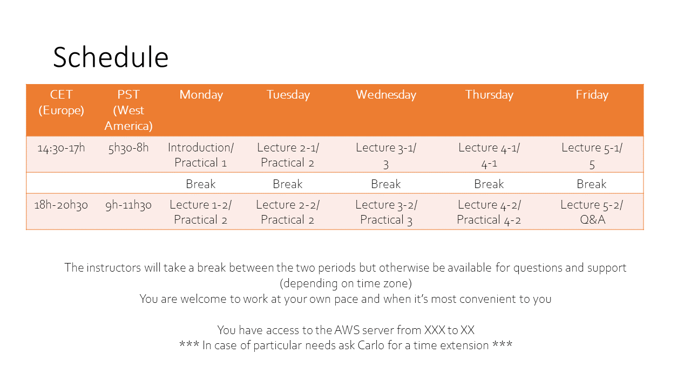
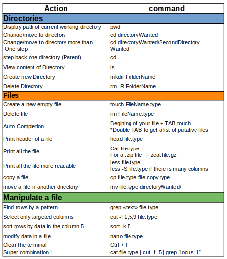

# 2024 Physalia Adaptation Genomics Course <!-- omit from toc -->

## Welcome to the GitHub page of the course 👋 <!-- omit from toc -->
This repository includes scripts, input data, and images associated with the practical sessions of the *2024 Physalia Course on Adaptation Genomics*, given by Mafalda Ferreira and Angela Fuentes Pardo.

These materials correspond to modified versions of the original files developed (and generously shared) by Anna Tigano, Yann Dorant and Claire Mérot, which are available [here](https://github.com/clairemerot/physalia_adaptation_course).

All tutorials (except for day 1) can be completed using the files provided in this repository. Therefore, each tutorial can be run independently, ensuring that everyone can start fresh every day (even if they were unable to complete a previous practical session).

- [Before the course](#before-the-course)
  - [Install required programs](#install-required-programs)
  - [(Optional) Get familiar with Unix and R](#optional-get-familiar-with-unix-and-r)
- [During the course](#during-the-course)
  - [Schedule](#schedule)
  - [Log in to the AWS server from your computer](#log-in-to-the-aws-server-from-your-computer)
- [Tutorials](#tutorials)
  - [Overview](#overview)
  - [Day 1: Handling NGS data, from raw reads to SNPs matrix](#day-1-handling-ngs-data-from-raw-reads-to-snps-matrix)
  - [Day 2: Population structure and confounding factors](#day-2-population-structure-and-confounding-factors)
  - [Day 3: Outlier detection and Genome x Environment associations](#day-3-outlier-detection-and-genome-x-environment-associations)
  - [Day 4: Accounting for Structural Variants](#day-4-accounting-for-structural-variants)
  - [Day 5: Functional approaches](#day-5-functional-approaches)
  - [Additional resources](#additional-resources)
  - [Cheatsheet of terminal commands](#cheatsheet-of-terminal-commands)

## Before the course

### Install required programs

Most exercises will be run using the cloud compute service [AWS](https://aws.amazon.com/), and others will be run on your local computer. Thus, please make sure you have the packages listed [here](00_before_the_course/programs_to_install_Students.md) installed on your computer before the course begins.

### (Optional) Get familiar with Unix and R
Prerequisites of the course are that you are familiar with  [Unix](https://en.wikipedia.org/wiki/Unix) and [R](https://www.r-project.org/). If you think you need a quick refresher of any of them, take a look at the suggested readings in this [document](00_before_the_course/tutorials_unix_R_optional.md).

## During the course
### Schedule
Below you can find the proposed schedule for the week. We will maintain some flexibility in the schedule to allow enough time for questions and discussions.

### Log in to the AWS server from your computer
>TO UPDATE!

Please follow the [instructions shared by Carlo](00_before_the_course/Connection%20to%20the%20Amazon%20EC2%20service_.pdf).

[Additional info for AWS for Mac OS X and Linux users](00_before_the_course/AWS_mac.md).

[Additional info for AWS for windows users using Putty/winSCP](00_before_the_course/AWS_windows.md).

## Tutorials 

### Overview

### Day 1: Handling NGS data, from raw reads to SNPs matrix

- **Data**: All exercises will be based on the dataset from [Cayuela et al. (2020), Molecular Ecology](https://onlinelibrary.wiley.com/doi/10.1111/mec.15499).
 
- **Genome assembly**: For this course, we generated a dummy assembly of about 90 MB (instead of about 500 MB) and 5 chromosomes (instead of 24) to expedite analysis running time.

- **Raw data**: Data were generated using a reduced-representation approach (GBS/RADseq) and sequenced with IonTorrent. Note that the analyses we will learn during the course are scalable to whole genome resequencing data or other type of genomic data.

1-1: Getting familiar with Unix environment

1-2: From raw sequences to mapped reads

1-3: Calling variants with Stacks
 
### Day 2: Population structure and confounding factors

2-1: FST statistics with vcftools (optional: with Stacks, optional: Pairwise-FST and Isolation-by-Distance)

2-2: Principal component analysis (PCA)

2-3: Population clustering with LEA

2-4: Discriminant Analysis of Principal Components (DAPC)

### Day 3: Outlier detection and Genome x Environment associations

- **Data**: We focus on 12 populations from Canada for which there is almost no geographic structure but great environmental variability.

3-1: Genetic structure and LD-pruning

3-2: Outlier of differentiation with two methods (Outflank & Baypass)

3-3: Genotype-Environnement Associations with two methods (Baypass & Redundancy Analysis)

### Day 4: Accounting for Structural Variants
>TO UPDATE

- **Data**: We focus on 12 population from Canada. We recommend that you pick one of the two tutorials (haploblocks by local PCA or CNVs from RAD-seq data)

4-1: Investigating haplotypes blocks (~inversions?)

This tutorial include working on local PCA, but also calculation of LD, Fst and observed fraction of heterozygotes which may be useful in other contexts

4-2: Filtering duplicated loci in RAD-seq data (~ Copy Number Variants, CNVs)

This tutorial show how to filter RAD loci to exclude duplicated ones (keep a reliable dataset for SNP analysis), and then how to analyse the duplicated loci for environmental associations.

4-3: Detecting SV with Delly ??

### Day 5: Functional approaches

5-1: SNPeff annotation of SNPs for coding & regulatory regions

5-2: Intersection between SNPs and genes with bedtools

5-3: Gene ontology enrichment

5-4: (Optional) Intersection between CNVs and repeats/TE

### Additional resources

### Cheatsheet of terminal commands

