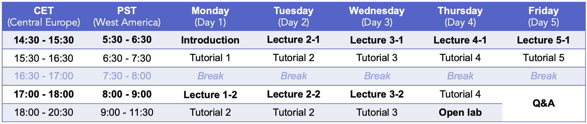

# 2024 Physalia Adaptation Genomics Course <!-- omit from toc -->

## Welcome 👋 <!-- omit from toc -->
This GitHub page includes scripts, input data, and images associated with the practical sessions of the *2024 Physalia Course on Adaptation Genomics*, given by Mafalda Ferreira and Angela Fuentes Pardo.

These materials correspond to modified versions of the original files developed (and generously shared) by Anna Tigano, Yann Dorant and Claire Mérot, which are available [here](https://github.com/clairemerot/physalia_adaptation_course).

All tutorials (except for day 1) can be completed using the files provided in this GitHub page. Therefore, each tutorial can be run independently, ensuring that everyone can start fresh every day (even if they were unable to complete a previous practical session).

## Table of contents <!-- omit from toc -->
- [Before the course](#before-the-course)
  - [Install required software](#install-required-software)
  - [(Optional) Refresher on Unix and R](#optional-refresher-on-unix-and-r)
- [During the course](#during-the-course)
  - [Schedule](#schedule)
  - [Log in to the AWS server from your computer](#log-in-to-the-aws-server-from-your-computer)
- [Tutorials](#tutorials)
  - [Visual overview](#visual-overview)
  - [Day 1: Handling NGS data, from raw reads to SNPs matrix](#day-1-handling-ngs-data-from-raw-reads-to-snps-matrix)
  - [Day 2: Population structure and confounding factors](#day-2-population-structure-and-confounding-factors)
  - [Day 3: Outlier detection and Genome-by-Environment associations](#day-3-outlier-detection-and-genome-by-environment-associations)
  - [Day 4: Accounting for Structural Variants](#day-4-accounting-for-structural-variants)
  - [Day 5: Functional approaches](#day-5-functional-approaches)
  - [Additional resources](#additional-resources)

## Before the course

### Install required software

Some exercises will be run using the cloud compute service [AWS](https://aws.amazon.com/) ("on the server"), and others will be run on your local computer. Thus, please make sure you have installed on your computer the software listed below before the course begins:

- [R](https://www.r-project.org)
- [RStudio](https://posit.co/download/rstudio-desktop/)
- R packages listed [here](00_before_the_course/software_required_by_students.md)
- [FileZilla](https://filezilla-project.org)

**For Windows users:**
- [MobaXterm](https://mobaxterm.mobatek.net)

### (Optional) Refresher on Unix and R
A prerequisite of the course is that you are familiar with [Unix](https://en.wikipedia.org/wiki/Unix) and [R](https://www.r-project.org/). If you think you need a quick refresher of any of them, please take a look at the suggested readings available [here](00_before_the_course/readings_on_Unix_and_R.md).

## During the course
### Schedule
Below you can find the proposed schedule for the week. We will maintain some flexibility in the schedule to allow enough time for questions and discussions.

### Log in to the AWS server from your computer
Please follow the [instructions shared by Carlo](Connection_to_the_Amazon_EC2_service_2024.pdf).

## Tutorials 

### Visual overview

### Day 1: Handling NGS data, from raw reads to SNPs matrix

- **Data**: All exercises will be based on the dataset from [Cayuela et al. (2020), Molecular Ecology](https://onlinelibrary.wiley.com/doi/10.1111/mec.15499).
 
- **Genome assembly**: For this course, we generated a dummy assembly of about 90 MB (instead of about 500 MB) and 5 chromosomes (instead of 24) to expedite analysis running time.

- **Raw data**: Data were generated using a reduced-representation approach (GBS/RADseq) and sequenced with IonTorrent. 
>OBS! The analyses we will learn during the course are scalable to whole genome resequencing data or other type of genomic data.

1-1: Getting familiar with Unix environment

1-2: From raw sequences to mapped reads

1-3: Calling variants with Stacks
 
### Day 2: Population structure and confounding factors

2-1: FST statistics with vcftools (optional: with Stacks, optional: Pairwise-FST and Isolation-by-Distance)

2-2: Principal component analysis (PCA)

2-3: Population clustering with LEA

2-4: Discriminant Analysis of Principal Components (DAPC)

### Day 3: Outlier detection and Genome-by-Environment associations

- **Data**: We focus on 12 populations from Canada for which there is almost no geographic structure but great environmental variability.

3-1: Genetic structure and LD-pruning

3-2: Outlier of differentiation with two methods (Outflank & BayPass)

3-3: Genotype-Environnement Associations with two methods (Baypass & Redundancy Analysis)

### Day 4: Accounting for Structural Variants

- **Data**: We focus on 12 population from Canada. We recommend that you pick one of the two tutorials (haploblocks by local PCA or CNVs from RAD-seq data)

4-1: Investigating haplotypes blocks (~inversions?)

This tutorial include working on local PCA, but also calculation of LD, FST and observed fraction of heterozygotes which may be useful in other contexts

### Day 5: Functional approaches

5-1: SnpEff annotation of SNPs for coding and regulatory regions

5-2: Intersection between SNPs and genes with bedtools

5-3: Gene ontology enrichment

5-4: (Optional) Intersection between CNVs and repeats/TE

### Additional resources

[Cheat sheet of basic Unix commands](00_before_the_course/Unix_command_cheatsheet.pdf).

[Cheat sheet of basic R commands](00_before_the_course/base-r-cheat-sheet.pdf).
